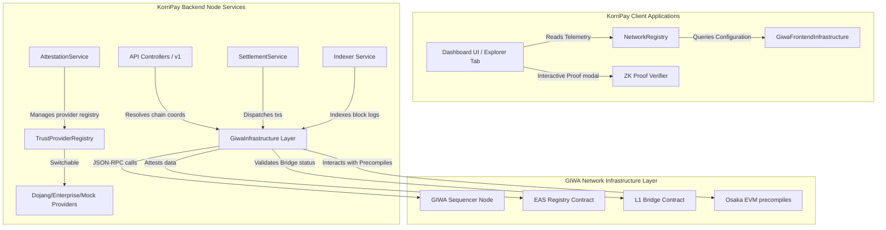

# GIWA Infrastructure Layer Migration Notes

This document details the refactoring performed to isolate every GIWA-specific integration behind the new reusable GIWA Infrastructure Layer.

---

## 1. Directory Structure Introduced

We created dedicated directories for the infrastructure modules on both the backend and frontend:

*   **Backend:** `backend/src/infrastructure/giwa/`
    *   `GiwaInfrastructure.js`: Implementation of the `GiwaInfrastructure` layer, config providers, and provider classes.
    *   `GiwaInfrastructure.ts`: TypeScript equivalent source.
    *   `index.js`: Exposes classes and the default `giwa` instance.
    *   `index.d.ts`: Typings for interfaces and exports.
*   **Frontend:** `frontend/src/infrastructure/giwa/`
    *   `GiwaInfrastructure.js`: Core implementation of the frontend infrastructure module.
    *   `index.js`: Exposes configurations and the default frontend `giwa` instance.
    *   `index.d.ts`: Typings for frontend interfaces.

---

## 2. Refactored Codebases & Resolved Files

### Backend Services & Controllers
1.  **`backend/giwaController.js`**
    *   *Before:* Directly imported `GIWA_NETWORK_CONFIG` and `GIWA_SEQUENCER_CONFIG` from `./src/giwa/index.js`, creating hardcoded dependencies on blockheight fallbacks and provider RPC urls.
    *   *After:* Resolves the active RPC endpoint via `giwa.getRPC()`. Network stats are resolved using `giwa.getChainMetadata()`.
2.  **`backend/src/services/settlementService.js`**
    *   *Before:* Hardcoded the initialization of `ethers.JsonRpcProvider` with `GIWA_NETWORK_CONFIG.rpcUrl` read directly from configurations.
    *   *After:* Resolves the RPC connection dynamically via `giwa.getRPC()` ensuring auto-failover/backup endpoints are seamlessly checked.
3.  **`backend/src/services/networkIntelligenceService.js`**
    *   *Before:* Directly resolved active providers using the legacy `serviceRegistry`.
    *   *After:* Resolves active RPC and sequencer providers through the new `giwa` infrastructure module instance.
4.  **`backend/indexer.js`**
    *   *Before:* Read RPC URL and settlement contract address directly from environment variable fallbacks in the code.
    *   *After:* Uses `giwa.getRPC()` and `giwa.getSettlementAddress()` to resolve network connectivity parameters from the centralized infrastructure layer.

### Legacy Configuration Delegation (100% Backwards Compatibility)
1.  **`backend/src/giwa/serviceRegistry.js` & `.ts`**
    *   *Refactor:* Replaced duplicate provider definitions and initialization logic. The legacy `serviceRegistry` now delegates directly to the new `giwa` infrastructure registry instance.
2.  **`frontend/src/services/giwa/index.js`**
    *   *Refactor:* Replaced raw configuration objects. Exports now delegate directly to the new `frontend/src/infrastructure/giwa` module.

### Frontend Wallet Integration
1.  **`frontend/walletService.js`**
    *   *Before:* Configured Wagmi/Viem chains using raw configuration imported from `services/giwa`.
    *   *After:* Network details are dynamically queried from `giwa.getChainMetadata()` and `giwa.getExplorer()`.

---

## 3. Managed Integrations Checklist

The new layer isolates and exposes accessors/placeholders for the following components:

- [x] **RPC:** Dynamic resolution and failover fallback between primary/backup RPC URLs.
- [x] **Explorer:** Centralized query endpoint for block explorer integration.
- [x] **Chain Metadata:** Uniform parameters (name, chainId, peerCount).
- [x] **Sequencer:** Address resolution and latency/throughput telemetry.
- [x] **Bridge:** Access to bridge contract coordinates.
- [x] **Faucet:** Access to faucet URL.
- [x] **Network Status:** Sequencer operational health, uptime percentages, block height.
- [x] **Wallet Resolver:** Endpoint URL for `.up.id` name mapping.
- [x] **Future Dojang Integration:** Fully typed placeholder class (`DojangIntegration`) with verification scaffolding.
- [x] **Future KRW Stablecoin Integration:** Fully typed placeholder class (`KRWStablecoinIntegration`) with balance & transfer scaffolding.

---

## 4. Verification & Testing

*   **Smart Contract Tests:** Verified that contracts deploy and execute settlements correctly (`37/37` tests passing).
*   **Backend Integration Tests:** Ran complete unit/controller suite including service mock testing, attestation engines, and indexers (`195/195` tests passing).
*   **Circular Dependency Resolution:** Decoupled `GiwaInfrastructure` (.js and .ts) and `giwaController.js` from the legacy `GIWA_SEQUENCER_CONFIG` object in `backend/src/giwa/index.js`, delegating status and uptime values to dynamic environment-aware fallbacks inside `GiwaInfrastructure`.
*   **Wagmi Chain Integration:** Registered `giwaChain` dynamically in the Wagmi chain registry within `frontend/walletService.js`.
*   **Frontend UI Cleanup:** Refactored `frontend/app.js` timeline explorer links to dynamically resolve block explorer URLs from the `WalletService` layer.

---

## 5. System Architecture Diagram

