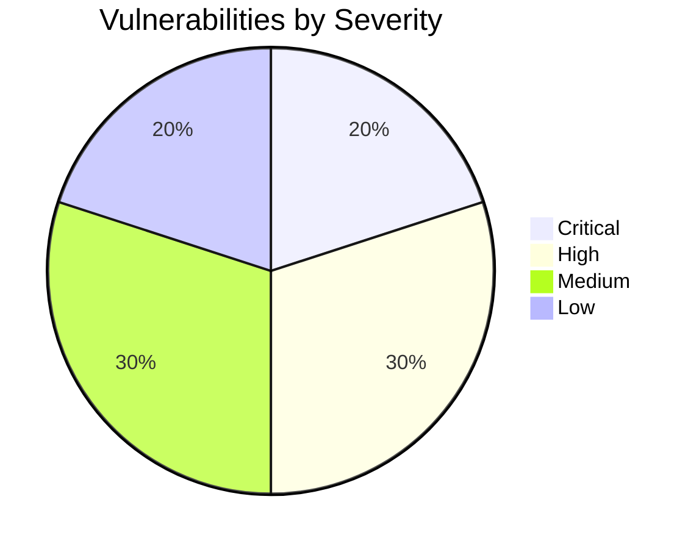

# KorriPay Security Audit Report

This report presents the security audit findings for the KorriPay platform across the frontend web client, backend APIs, smart contracts, database, and webhook subsystems.

---

## 1. Executive Summary

KorriPay implements a robust, centralized blockchain infrastructure mapping and ZK-SNARK verifier simulations for GIWA. However, a deep code review of the platform revealed several critical and high-risk security vulnerabilities in authentication, role-based access controls (RBAC), browser integration, and network requests.

---

## 2. Critical Severity Vulnerabilities

### 2.1 Unauthenticated Session Generation / Impersonation Fallback
* **File:** [server.js](file:///home/oyeolorun/KorriPay/backend/server.js#L81-L91)
* **CVSS Score:** 9.8 (Critical) `CVSS:3.1/AV:N/AC:L/PR:N/UI:N/S:U/C:H/I:H/A:H`
* **OWASP Mapping:** A01:2021-Broken Access Control
* **Description:** 
  In the `requireAuth` authentication middleware, if an authorization token prefix starts with `session-demo-` or `session-wallet-`, the middleware queries the database for the *very first user record* and automatically assigns it as the active session. This bypasses signature verification, allowing anyone to gain administrative control over the platform simply by crafting a fake token prefix.
* **Remediation:** 
  Remove the fallback session mapper completely from production environments. Session tokens must be validated strictly against a cryptographically secure session store or database mapping table.

### 2.2 Server-Side Request Forgery (SSRF) in Webhook Dispatch
* **File:** [webhookService.js](file:///home/oyeolorun/KorriPay/backend/src/services/webhookService.js#L115)
* **CVSS Score:** 8.6 (High/Critical) `CVSS:3.1/AV:N/AC:L/PR:N/UI:N/S:C/C:H/I:N/A:N`
* **OWASP Mapping:** A10:2021-Server-Side Request Forgery
* **Description:** 
  The webhook service dispatches subscription payloads to arbitrary, user-submitted URLs using `fetch()`. The destination IP is not filtered, enabling an attacker to trigger internal requests to loopback addresses (`127.0.0.1`) or local cloud metadata endpoints (`169.254.169.254`).
* **Remediation:** 
  Implement URL parsing and resolve IP addresses before dispatch. Restrict destination webhooks to public, non-reserved IP addresses.

---

## 3. High Severity Vulnerabilities

### 3.1 Role-Based Access Control (RBAC) Bypass in Organization Management
* **File:** [apiV1.js](file:///home/oyeolorun/KorriPay/backend/apiV1.js#L961-L997)
* **CVSS Score:** 8.0 (High) `CVSS:3.1/AV:N/AC:L/PR:L/UI:N/S:U/C:H/I:H/A:N`
* **OWASP Mapping:** A01:2021-Broken Access Control
* **Description:** 
  The corporate organization router endpoints (`/organizations/members`, `/organizations/members/:userId`) invoke `getActiveOrg` to bind organizational details, but they fail to verify whether the calling member's role (`req.memberRole`) is `OWNER` or `ADMIN`. Consequently, `DEVELOPER` or `AUDITOR` accounts can invite new members or change transaction limits.
* **Remediation:** 
  Add role-validation checks to every organization management endpoint before invoking the underlying database services.

### 3.2 Cryptographically Insecure Pseudorandom Nonces and Tokens
* **File:** [server.js](file:///home/oyeolorun/KorriPay/backend/server.js#L412-L414)
* **CVSS Score:** 7.5 (High) `CVSS:3.1/AV:N/AC:H/PR:N/UI:N/S:U/C:H/I:H/A:N`
* **OWASP Mapping:** A02:2021-Cryptographic Failures
* **Description:** 
  The auth endpoints use `Math.random()` to generate nonces for wallet signature verification and user session tokens. Because `Math.random()` is predictable, attackers can calculate future outputs, hijack sessions, or replay verify signatures.
* **Remediation:** 
  Replace all instances of `Math.random()` with `crypto.randomBytes(n).toString('hex')` or cryptographically secure UUID generators.

### 3.3 DOM-Based Cross-Site Scripting (XSS) via Unescaped innerHTML
* **File:** [app.js](file:///home/oyeolorun/KorriPay/frontend/app.js) (e.g. lines 657, 902, 2890, 2928, 3002)
* **CVSS Score:** 8.0 (High) `CVSS:3.1/AV:N/AC:L/PR:L/UI:R/S:C/C:H/I:H/A:N`
* **OWASP Mapping:** A03:2021-Injection
* **Description:** 
  The client application renders dynamic data (like contact names, favorite descriptions, and transaction records) directly into DOM elements using `.innerHTML`. If a user updates their name or sends metadata containing malicious tags, it will execute in the browser of other users viewing the logs.
* **Remediation:** 
  Sanitize inputs or use `.textContent` and `.innerText` to securely bind dynamic values.

---

## 4. Medium Severity Vulnerabilities

### 4.1 Insecure Storage of Authorization Tokens in LocalStorage
* **File:** [app.js](file:///home/oyeolorun/KorriPay/frontend/app.js)
* **CVSS Score:** 5.0 (Medium) `CVSS:3.1/AV:N/AC:H/PR:N/UI:R/S:U/C:H/I:N/A:N`
* **OWASP Mapping:** A04:2021-Insecure Design
* **Description:** 
  The session tokens are stored in `localStorage`, which lacks protection against script access. Any script execution via XSS can instantly exfiltrate credentials.
* **Remediation:** 
  Store session tokens in secure, `HttpOnly`, `SameSite=Strict`, and `Secure` cookies.

### 4.2 Insecure CORS Wildcard Configuration
* **File:** [server.js](file:///home/oyeolorun/KorriPay/backend/server.js#L29)
* **CVSS Score:** 6.5 (Medium) `CVSS:3.1/AV:N/AC:L/PR:N/UI:R/S:U/C:H/I:N/A:N`
* **OWASP Mapping:** A05:2021-Security Misconfiguration
* **Description:** 
  The Express server mounts `cors()` without restrictions, allowing any domain to send queries to the backend.
* **Remediation:** 
  Explicitly configure CORS to allow requests only from verified hostnames in the production configuration.

### 4.3 Missing Rate Limiting on Authentication Endpoints
* **File:** [server.js](file:///home/oyeolorun/KorriPay/backend/server.js)
* **CVSS Score:** 5.3 (Medium) `CVSS:3.1/AV:N/AC:L/PR:N/UI:N/S:U/C:N/I:N/A:L`
* **OWASP Mapping:** A05:2021-Security Misconfiguration
* **Description:** 
  Endpoints `/api/auth/nonce`, `/api/auth/verify`, and `/api/auth/signin` lack rate limits, exposing the server to brute-force attempts and DoS.
* **Remediation:** 
  Integrate `express-rate-limit` to restrict requests to sensitive routes.

---

## 5. Low Severity Vulnerabilities

### 5.1 Hardcoded Database Credentials in Repository
* **File:** [.env](file:///home/oyeolorun/KorriPay/backend/.env)
* **CVSS Score:** 3.3 (Low) `CVSS:3.1/AV:L/AC:L/PR:L/UI:N/S:U/C:L/I:L/A:N`
* **Description:** 
  The database credentials are saved inside `.env` which is tracked in version control.
* **Remediation:** 
  Add `.env` to `.gitignore` and distribute configurations through deployment orchestrators.

### 5.2 Missing HTTP Security Headers and CSP
* **File:** [server.js](file:///home/oyeolorun/KorriPay/backend/server.js)
* **CVSS Score:** 3.7 (Low) `CVSS:3.1/AV:N/AC:H/PR:N/UI:N/S:U/C:L/I:N/A:N`
* **Description:** 
  The server does not send frame protection, MIME-type enforcement headers, or a Content Security Policy (CSP).
* **Remediation:** 
  Integrate the `helmet` package into the Express middleware stack.

---

## 6. Smart Contract Review
The three smart contracts (`KorriSettlement.sol`, `KorriTreasury.sol`, and `MockKRWStable.sol`) were inspected:
* **Access Control:** Verified correctly via OpenZeppelin's `AccessControl`. All administrative methods enforce `onlyRole(DEFAULT_ADMIN_ROLE)` or similar custom modifiers.
* **Reentrancy Guard:** Correctly configured; critical transfer methods utilize the `nonReentrant` modifier.
* **Safe Transfers:** Utilizes `SafeERC20` (`safeTransfer`, `safeTransferFrom`), preventing silent failures with non-standard ERC20 tokens.
* **Risk/Note:** The `KorriTreasury` contract can hold high balances, making the `MANAGER_ROLE` a high-value target. Ensure key-management setups (like Multisig or MPC wallets) are deployed in production.
