# KorriPay Blockchain Integration Audit Report

This report provides a detailed, comprehensive audit of the smart contracts, signature routing, cryptographic authentication, event indexers, and transaction flows in the KorriPay fintech dashboard.

---

## 1. Architecture Diagram & Transaction Flow

The sequence diagram below illustrates the routing of cryptographic signatures, on-chain execution paths, event emissions, database updates, and indexer actions during the settlement pipeline.

```mermaid
sequenceDiagram
    autonumber
    actor User as Sender Wallet
    participant Front as Frontend (WAGMI/Viem)
    participant Token as Token Contract (USDC/MockKRW)
    participant Settlement as KorriSettlement Contract
    participant Treasury as KorriTreasury Contract
    participant Indexer as Node Indexer (Ethers)
    participant DB as PostgreSQL DB

    User->>Front: Click Confirm Send
    rect rgb(30, 41, 59)
        Note over Front,Token: Step 1: ERC20 Spending Approval
        Front->>Token: approve(settlementAddress, amount)
        Token-->>User: Request Signature
        User->>Token: Sign & Approve
        Token-->>Front: Approval TX Confirmed
    end
    rect rgb(15, 23, 42)
        Note over Front,Settlement: Step 2: Escrow Initiation
        Front->>Settlement: initiateSettlement(fromToken, toToken, amount, recipientDetails)
        Settlement-->>User: Request Signature
        User->>Settlement: Sign & Broadcast
        Settlement-->>Front: Settlement TX Hash
    end
    Note over Settlement: Emits event: TransferCreated
    Indexer->>Settlement: Catch Event via RPC Subscription
    Indexer->>DB: Upsert settlement record as 'Pending'

    rect rgb(17, 94, 89)
        Note over Settlement,Treasury: Step 3: Operator Payout Confirmation
        Front->>Settlement: completeSettlement(settlementId, externalTxHash) [OPERATOR_ROLE]
        Settlement->>Treasury: Forward escrowed funds to custody
        Settlement-->>Front: Confirm completed state
    end
    Note over Settlement: Emits event: TransferConfirmed
    Indexer->>Settlement: Catch Event via RPC Subscription
    Indexer->>DB: Update status to 'Completed' & log timestamp
```

---

## 2. Feature Classification

Each feature in the KorriPay ecosystem has been audited and classified into three integration levels:

| Feature / System Component | Integration Level | Technical Classification & Verification |
| :--- | :--- | :--- |
| **SIWE Authentication** | **Partially Onchain** | Cryptographic off-chain verification. Signatures are generated by the user's private key and verified off-chain using the `ethers` library on the Node.js backend. |
| **Settlement Contract** | **Fully Onchain** | Deployed as `KorriSettlement.sol`. Handles local and cross-border escrow hold states and operator resolutions. |
| **Treasury Contract** | **Fully Onchain** | Deployed as `KorriTreasury.sol`. Manages custody reserves and processes transfers only via authorized actors. |
| **MockKRW Stablecoin** | **Fully Onchain** | Deployed as `MockKRWStable.sol`. Direct ERC20 compliance with decimal overrides and minter/burner controls. |
| **Event Indexer** | **Fully Onchain** | Active Node listener service (`indexer.js`) using `ethers.JsonRpcProvider` to monitor on-chain events and synchronize database records. |
| **Transaction Send Flow** | **Partially Onchain** | Triggers on-chain ERC20 approvals and invokes `initiateSettlement` on the smart contract before saving states in the database. |
| **Asset Swap Module** | **Mocked** | Simulated off-chain. Transactions update values in the PostgreSQL `wallets` table rather than executing on-chain swaps via an AMM (e.g. Uniswap). |
| **Bill Pay Module** | **Mocked** | Simulated off-chain. Balance adjustments are recorded in PostgreSQL logs rather than interacting with utility payment contracts. |

---

## 3. Codebase Inspection & Vulnerability Analysis

### A. SIWE Authentication (`backend/server.js`)
* **Logic**: Frontend generates a unique login message containing a server-generated random nonce. The backend recovers the signing address using `ethers.verifyMessage` and creates a session token.
* **Security Strengths**: 
  * Strict nonce verification prevents replay attacks.
  * Nonces are deleted immediately upon validation, rendering them single-use.
* **Identified Vulnerabilities**:
  * **No Domain Validation**: The backend does not check the `Host` or `Origin` headers inside the SIWE string. An attacker could potentially phish the signature on a malicious domain.

### B. Settlement Contract (`KorriSettlement.sol`)
* **Logic**: Escrows either native ETH or ERC20 tokens into the contract and tracks the state via `SettlementStatus` enums.
* **Security Strengths**:
  * Employs OpenZeppelin's `ReentrancyGuard` on all state-mutating functions.
  * Correct use of `safeTransferFrom` and `safeTransfer` for ERC20 assets.
* **Identified Vulnerabilities**:
  * **Centralization Hazard**: The contract grants full execution capabilities (`completeSettlement` and `refundSettlement`) to the `OPERATOR_ROLE` without requiring multiple signatures or decentralized oracle consensus.

### C. Treasury Contract (`KorriTreasury.sol`)
* **Logic**: Receives deposits and holds reserves. Releases funds when authorized by `SETTLEMENT_ROLE` or `MANAGER_ROLE`.
* **Security Strengths**:
  * Distinct separation of concerns via Access Control roles (`MANAGER_ROLE` vs. `SETTLEMENT_ROLE`).
  * Employs `receive()` to handle fallback native ETH transfers cleanly.
* **Identified Vulnerabilities**:
  * **Administrative Privilege Escalation**: If the `DEFAULT_ADMIN_ROLE` key is compromised, the attacker can instantly grant themselves `MANAGER_ROLE` and withdraw the entire vault reserve.

### E. MockKRW Stablecoin (`MockKRWStable.sol`)
* **Logic**: Standard ERC20 token with decimal overrides (18 decimals) and minter/burner permissions.
* **Security Strengths**:
  * Correct role validation using OpenZeppelin's `onlyRole`.
* **Identified Vulnerabilities**:
  * **No Mint Cap**: There is no hard cap on the supply of `MockKRWStable`, allowing the system admin to mint an arbitrary amount of tokens.

### F. Event Indexer (`backend/indexer.js`)
* **Logic**: Uses a JsonRpcProvider to listen to `TransferCreated` and `TransferConfirmed` events, performing an initial historic sync of 5,000 blocks on startup.
* **Security Strengths**:
  * Employs `upsert` queries to prevent database duplication of events.
  * Robust automatic connection retry loop when the RPC node goes offline.
* **Identified Vulnerabilities**:
  * **Single Point of Failure**: The indexer relies on a single RPC endpoint. If the RPC endpoint rate-limits or drops offline, database states will fall out of sync with the blockchain.

---

## 4. Missing Contract Integrations
1. **On-Chain Swaps**: The current swap interface operates entirely off-chain in PostgreSQL. To resolve this, the system needs to integrate with Uniswap V3's `SwapRouter` or a dedicated custom OTC pricing contract.
2. **Oracle Integration**: Exchange rates are hardcoded. Chainlink price feeds (`AggregatorV3Interface`) must be integrated to determine correct USD/KRW values on-chain.
3. **Decentralized Multi-Sig Custody**: Payout approvals should rely on Gnosis Safe multi-signature routing rather than a single administrator-controlled operator address.

---

## 5. Production Readiness Score

### Final Score: **82 / 100**

| Category | Score | Notes & Justification |
| :--- | :--- | :--- |
| **Contract Quality** | **90%** | Excellent use of OpenZeppelin access controls, safe libraries, and reentrancy guards. All local unit tests pass cleanly. |
| **Indexer Sync** | **85%** | Robust connection retry loop and block-syncing, though it lacks multi-node redundancy. |
| **Auth Security** | **80%** | Fully cryptographically secure SIWE signature verification, but lacks host-header validation. |
| **Integration Coverage** | **70%** | Core settlements are on-chain, but swaps and utility payments remain mocked off-chain in database tables. |

---
