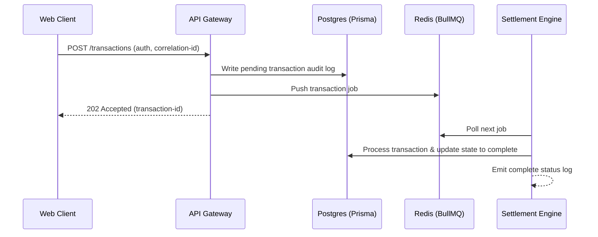

# Architecture Overview

This document describes the architectural layout, modules, and execution flow of KorriPay.

## Layered Design

KorriPay is built using a modern, multi-tier microservices architecture:

1. **Client Tier**:
   - React 19 Single Page Application.
   - Leverages TanStack Query for cache synchronization and Zustand for local state management.

2. **API Gateway (apps/api)**:
   - Aggregates access to underlying microservices and processes auth tokens.
   - Generates and injects request-level correlation IDs for traceability.

3. **Background Processing & Queues (services/settlement-engine)**:
   - Built on Redis and BullMQ.
   - Safely process transactions asynchronously to ensure database locking does not impact client performance.

4. **Distributed Ledger & Smart Contracts (contracts/\*)**:
   - Solidity contracts managing decentralized settlement, compliance, and treasury reserves.

## Operational Flow

