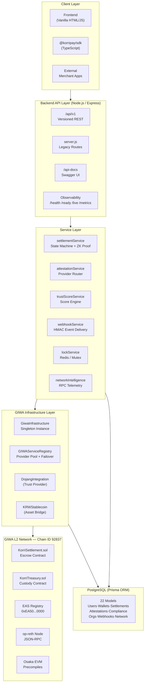
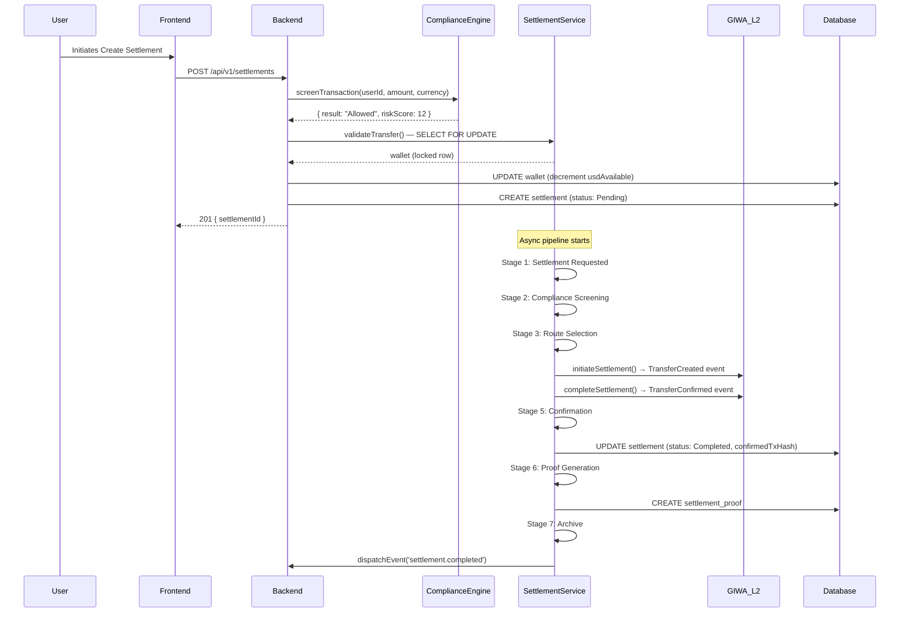

# KorriPay — System Overview

> **Version:** RC2 · **Last Updated:** 2026-07-07  
> This document provides a high-level view of the entire KorriPay platform — what it does, how its components relate, and the design principles that govern them.

---

## What Is KorriPay?

KorriPay is an **institutional-grade, cross-border payment platform** built natively on the **GIWA Layer-2 blockchain** (Chain ID: `92837`). It enables businesses and individuals to execute real-time, cryptographically-proven settlements across currencies (USD, KRW, NGN) with an on-chain compliance and attestation layer.

---

## System Components

---

## Design Principles

| Principle | Implementation |
|---|---|
| **GIWA-Native First** | All blockchain interactions route through `GiwaInfrastructure`. No direct hardcoded RPC URLs. |
| **Provider Abstraction** | Trust providers (Mock → Dojang → Enterprise) implement `BaseAttestationProvider`. Swap at runtime. |
| **Traceability** | Every settlement has a `pipelineHistory` JSON log, a `SettlementProof`, and an L2 `txHash`. |
| **Defence in Depth** | Helmet headers + CORS + Rate limiting + Auth + Row-level DB locks + Distributed Redis locks. |
| **Operational Transparency** | Prometheus `/metrics`, DB-pinged `/ready`, process-level `/live`, and full `/health` report. |
| **Zero Trust Middleware** | Every protected route runs through `requireAuth` + session validation before handlers execute. |

---

## Technology Choices

| Layer | Technology | Rationale |
|---|---|---|
| Runtime | Node.js 20 LTS | Async I/O ideal for concurrent settlement pipelines |
| Framework | Express.js | Minimal overhead; full control over middleware chain |
| ORM | Prisma + PostgreSQL | Type-safe queries; migration system; cascade relations |
| Blockchain | ethers.js v6 | Full EIP-712, ABI encoding, JsonRpcProvider support |
| Contracts | Solidity 0.8.20 + OpenZeppelin | Battle-tested access control and reentrancy guards |
| SDK | TypeScript ESM | Type safety for external integrators |
| Containers | Docker + Compose | Reproducible dev/staging/prod environments |
| Observability | Prometheus-compatible `/metrics` | Standard scrape format; integrates with Grafana |

---

## Data Flow: Settlement Request

---

## Environment Environments

| Environment | Compose File | Backend Port | Database | GIWA RPC |
|---|---|---|---|---|
| Local Dev | `Dockerfile.dev` | 5000 | Local Postgres | Simulation fallback |
| Staging | `docker-compose.staging.yml` | 3001 | `korripay_staging` | Staging RPC |
| Production | `docker-compose.prod.yml` | 3000 (behind nginx) | `korripay` | Live GIWA L2 |
