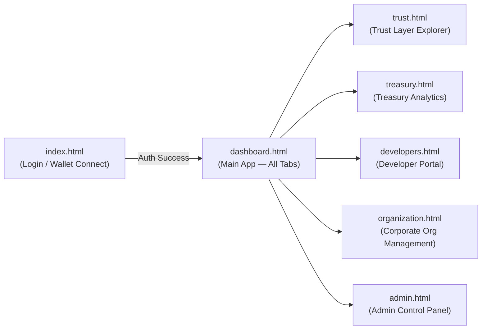
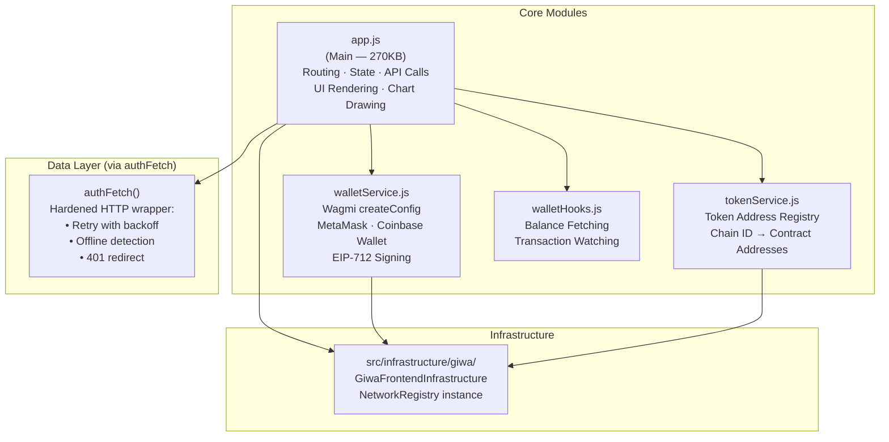
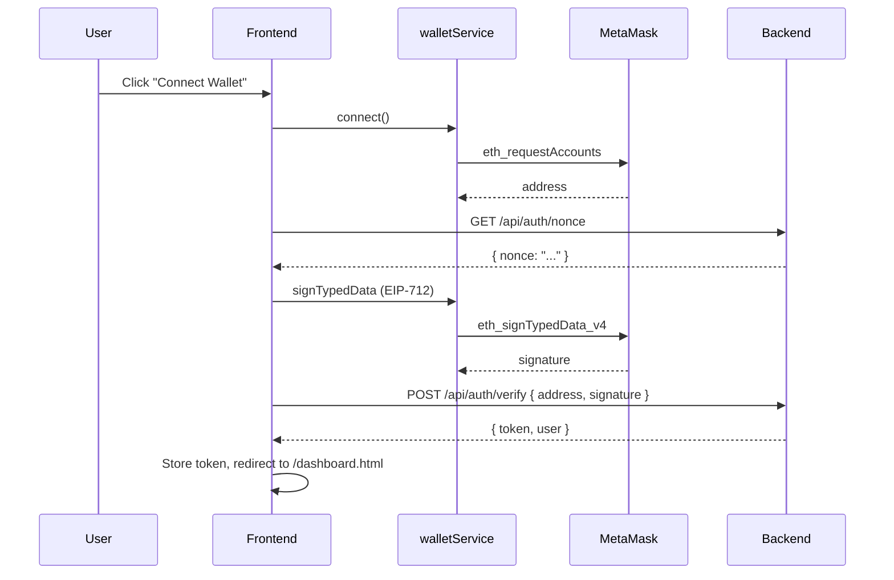

# Frontend Architecture

> **Stack:** Vanilla HTML5 · Vanilla CSS · Vanilla JavaScript (ES Modules via CDN) · Wagmi/Viem · ethers.js

---

## Overview

The KorriPay frontend is a **multi-page application (MPA)** served as static files by the Express backend. Navigation is handled through URL hash routing (`#send`, `#history`, `#portfolio`) and direct HTML file links for distinct pages such as `/trust.html`, `/developers.html`, and `/admin.html`.

---

## Page Structure



### Page Inventory

| File | Route | Purpose |
|---|---|---|
| `index.html` | `/` | Login, wallet signature authentication |
| `dashboard.html` | `/dashboard.html` | Main dashboard with hash-routed tabs |
| `trust.html` | `/trust` | GIWA Trust Layer provider explorer |
| `treasury.html` | `/treasury` | Treasury analytics, reserves, allocation |
| `developers.html` | `/developers` | API docs, SDK playground, webhook tester |
| `organization.html` | `/organization` | Corporate org RBAC management |
| `admin.html` | `/admin` | User management, KYC review, audit logs |
| `showcase.html` | `/showcase` | Interactive platform demo deck |
| `pay.html` | `/pay` | Standalone bill payment page |

---

## JavaScript Architecture



---

## `app.js` — Internal Organisation

`app.js` is the monolithic application file (~270KB). Its internal sections:

| Section | Responsibility |
|---|---|
| Constants & Config | API base URL, retry config, top-loader bar setup |
| `authFetch()` | Hardened fetch wrapper with exponential-backoff retry and offline state checks |
| Route Handler | Hash-change listener → renders the correct view |
| Dashboard Tab | Balance display, quick actions, recent transactions |
| Send Tab | 3-step wizard (Recipient → Amount → Review) |
| Swap Tab | FX engine UI, rate countdown timer, submission |
| History Tab | Filterable paginated transaction list |
| Portfolio Tab | Asset allocation donut chart (Chart.js), valuations |
| Compliance Tab | Risk profile display, KYC status |
| Explorer Tab | Settlement list with GIWA proof modals |
| Settings / Profile | User profile management |
| Modal Manager | `openModal()` / `closeAllModals()` with focus-trapping for accessibility |

---

## Wallet Integration



### Supported Connectors

| Connector | Library | Status |
|---|---|---|
| MetaMask | Wagmi injected connector | ✅ Active |
| Coinbase Wallet | Wagmi coinbaseWallet connector | ✅ Active |
| WalletConnect | Wagmi walletConnect connector | 🔄 Planned |

---

## `authFetch()` — Resilience Pattern

```javascript
// Retry configuration
const MAX_RETRIES = 3;
const BASE_DELAY_MS = 500;

// Features:
// 1. Detects navigator.onLine before each request
// 2. Retries on network errors / 5xx with exponential backoff
// 3. Redirects to / on 401 Unauthorized
// 4. Drives the global top-loading progress bar
```

---

## GIWA Frontend Infrastructure

`frontend/src/infrastructure/giwa/` mirrors the backend infrastructure module:

```
GiwaFrontendInfrastructure
    ├── getRPC()         → GIWA_RPC_URL env
    ├── getExplorer()    → Block explorer base URL
    ├── getChainId()     → 92837
    └── getChainMetadata() → name, symbol, chainId, hardfork
```

The singleton `giwa` instance is imported by `walletService.js` and `tokenService.js` to ensure all network references resolve dynamically from environment config.

---

## Accessibility & Performance

| Feature | Implementation |
|---|---|
| Focus trapping | Modal open/close captures and restores keyboard focus |
| ARIA labels | Buttons and interactive elements carry `aria-label` attributes |
| Keyboard navigation | Tab-order managed for all modal dialogs |
| Offline banner | Displayed when `navigator.onLine === false` |
| Top loading bar | CSS-animated progress indicator driven by `authFetch` |
| Async ZK tasks | ZK-SNARK simulation offloaded via `setTimeout(0)` to avoid main-thread blocking |
