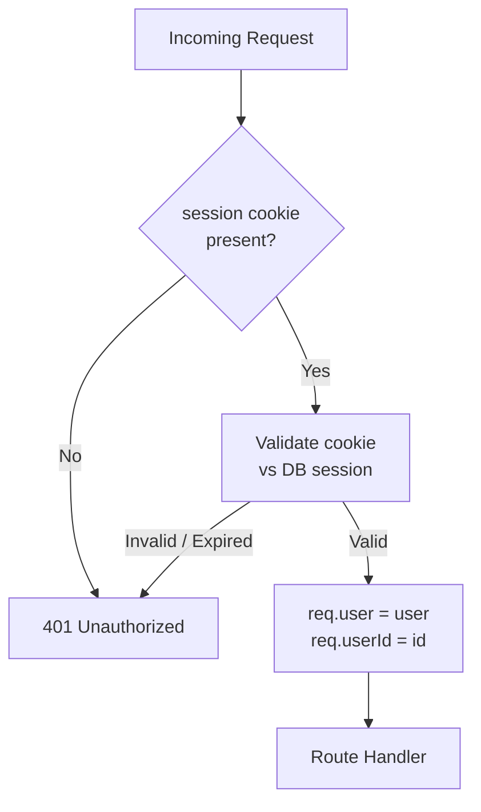
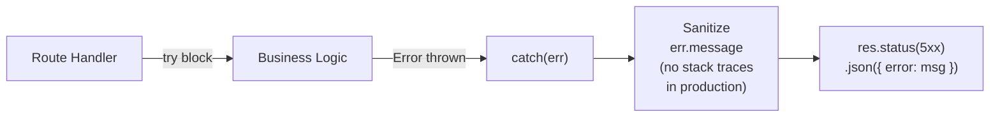

# Backend Architecture

> **Runtime:** Node.js 20 · **Framework:** Express.js · **ORM:** Prisma · **Protocol:** ESM (`"type": "module"`)

---

## Overview

The backend is a single Express.js application (`server.js`) that serves both the REST API and the static frontend files. It is structured as a layered application: middleware → routing → controllers → services → infrastructure.

---

## Layer Diagram

```mermaid
graph TB
    subgraph Middleware["Middleware Stack (applied in order)"]
        H["helmet()\nSecurity Headers"]
        C["cors()\nAllowlist-based CORS"]
        RL["rateLimit()\n100 req/15min"]
        COMP["compression()\nGzip responses"]
        JSON["express.json()\nBody parsing"]
        REQID["requestId\nX-Request-ID header"]
        LOG["morgan\nStructured access logs"]
    end

    subgraph Routes["Route Namespaces"]
        V1["/api/v1/*\napiV1.js\nSettlements · Wallets\nProofs · Attestations\nTrust · Identity · Network\nTreasury · Orgs · Webhooks"]
        CTRL["Controller Routes\n/api/wallet/*\n/api/fx/*\n/api/auth/*\n/api/admin/*\n/api/compliance/*\n/api/giwa/*\n/api/merchant/*\n/api/attestations/*\n/api/operations/*\n/api/contacts/*\n/api/explorer\n/api/analytics"]
        OBS["Observability\n/health /ready /live /metrics"]
        STATIC["Static Files\n/frontend/**"]
        SWAGGER["/api-docs\nSwagger UI"]
    end

    subgraph Services["Service Layer"]
        SS["settlementService\n5-stage async pipeline\nDistributed lock"]
        AS["attestationService\nProvider router\nMock/Dojang/Enterprise"]
        TS["trustScoreService\nWallet risk scoring"]
        WBS["webhookService\nHMAC delivery + retry"]
        OS["organizationService\nRBAC · Approval workflows"]
        NS["networkIntelligenceService\nRPC telemetry + snapshots"]
        LS["lockService\nRedis SET NX PX\nLocal mutex fallback"]
        CS["complianceService\nVelocity + rule screening"]
    end

    subgraph Infra["Infrastructure"]
        GIWA["GiwaInfrastructure\nSingleton — getRPC()\ngetExplorer() · getHealth()"]
        PRISMA["PrismaClient\nType-safe DB access"]
    end

    Middleware --> Routes
    Routes --> Services
    Services --> Infra
```



---

## Middleware Stack (Ordered)

```javascript
// Loaded in server.js startup sequence:
app.use(helmet())                   // 1. Security headers
app.use(cors({ origin: [...] }))    // 2. CORS allowlist
app.use(rateLimit({ max: 100 }))    // 3. Rate limiting
app.use(compression())              // 4. Gzip compression
app.use(express.json())             // 5. JSON body parsing
app.use(requestIdMiddleware)        // 6. X-Request-ID injection
app.use(morgan('combined'))         // 7. Access logging
```

---

## Route Namespaces

### `/api/v1` — Versioned Platform API (`apiV1.js`)

All versioned endpoints require a valid session cookie (`requireAuth`).

| Group | Endpoints |
|---|---|
| Settlements | `POST /settlements`, `GET /settlements`, `GET /settlements/:id` |
| Proofs | `GET /proofs` |
| Wallets | `GET /wallets` |
| Attestations | `GET /attestations`, `POST /attestations` |
| Trust | `GET /trust/attestations`, `GET /trust/score`, `GET/POST /trust/provider` |
| Identity | `POST /identity/verify` |
| Network | `GET /network` |
| Treasury | `GET /treasury/metrics` |
| Organisations | `GET /organizations/my-org`, `POST /organizations` |
| Webhooks | `GET/POST /webhooks`, `DELETE /webhooks/:id`, `POST /webhooks/:id/rotate` |
| Recipients | `GET /recipients/resolve` |

### Controller Routes (Legacy — `server.js`)

All controller routes also require `requireAuth` unless noted.

| Controller | Prefix | Key Operations |
|---|---|---|
| Auth | `/api/auth` | signup, signin, demo, nonce, verify |
| Wallet | `/api/wallet` | credit, debit, lock, unlock, settle, ledger, summary |
| FX | `/api/fx` | rates, convert, quote, fee, history, analytics |
| Transactions | `/api/transactions` | send, add, swap, pay |
| Compliance | `/api/compliance` | passport, rules, logs, profile, reports |
| Admin | `/api/admin` | users, wallets, txns, settlements, kyc, attestations, analytics, health, audit-logs |
| GIWA | `/api/giwa` | status |
| Merchant | `/api/merchant` | request, pay, settlements, stats |
| Attestations | `/api/attestations` | CRUD + verify by ID |
| Operations | `/api/operations` | status |
| Explorer | `/api/explorer` | all settlements |
| Analytics | `/api/analytics` | transaction volume dashboards |
| Contacts | `/api/contacts` | CRUD + favorite toggle |

### Observability (No Auth)

| Endpoint | Purpose | Response |
|---|---|---|
| `GET /live` | Liveness — is the process running? | `200 { status: "UP" }` |
| `GET /ready` | Readiness — is Postgres reachable? | `200 / 503` |
| `GET /health` | Full system health report | Memory, uptime, service map |
| `GET /metrics` | Prometheus scrape target | Plain-text gauge metrics |

---

## Authentication Flow



The `requireAuth` middleware:
1. Reads the `session` cookie
2. Looks up the token in the database session record
3. Attaches `req.user` and `req.userId` for downstream handlers
4. Falls back to a local session restoration for backward compatibility

---

## Error Handling



- Stack traces are **never** returned in `NODE_ENV=production`
- All `500` errors log to stdout with structured format: `[timestamp] [requestId] ERROR: message`
- Validation errors return `400` with a specific field-level `error` string

---

## Scheduled Tasks

| Task | Schedule | Implementation |
|---|---|---|
| Daily compliance report generation | Every 24 hours at server startup offset | `setInterval` in `server.js` startup block |
| Network snapshot persistence | On demand via `/api/v1/network` | `networkIntelligenceService.captureSnapshot()` |
| Webhook retry delivery | Immediate on failure, up to 3 retries | `webhookService` internal retry loop |
