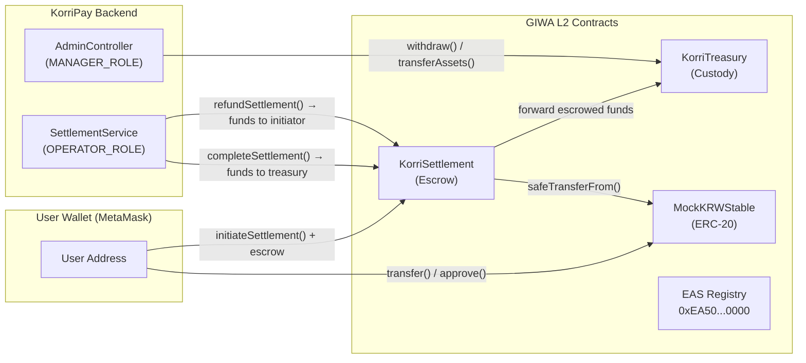
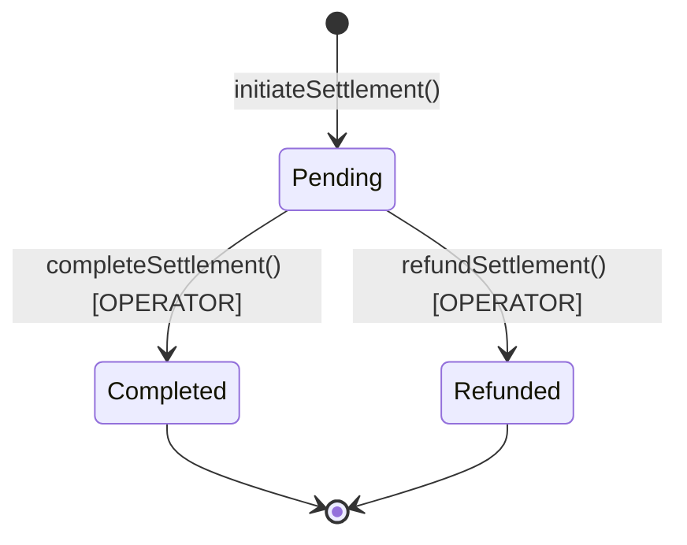

# Smart Contract Design

> **Language:** Solidity 0.8.20 · **Framework:** Hardhat · **Libraries:** OpenZeppelin 5.x  
> **Network:** GIWA L2 — Chain ID `92837` · **EVM Version:** Osaka

---

## Contract Overview

KorriPay deploys three smart contracts on the GIWA L2 network:

| Contract | Address (Default) | Role |
|---|---|---|
| `KorriSettlement` | `0x9fE46736679d2D9a65F0992F2272dE9f3c7fa6e0` | Escrow + settlement lifecycle |
| `KorriTreasury` | Configurable | Fund custody + controlled withdrawals |
| `MockKRWStable` | `0x9b3f5ce66f6d40dbbad1a8a56a3bf87f7d92837f` | Testnet KRW ERC-20 stablecoin |

---

## Contract Interaction Diagram



---

## `KorriSettlement.sol`

### Purpose
Acts as the **escrow layer** for all cross-border settlements. Funds are locked in the contract on initiation and released to the treasury on operator confirmation or returned to the sender on refund.

### Inheritance
```
KorriSettlement
    ├── AccessControl (OpenZeppelin)
    └── ReentrancyGuard (OpenZeppelin)
```

### Roles
| Role | `bytes32` Constant | Holders |
|---|---|---|
| `DEFAULT_ADMIN_ROLE` | `0x00...00` | Deployer / Admin multisig |
| `OPERATOR_ROLE` | `keccak256("OPERATOR_ROLE")` | Backend settlement service wallet |

### State Variables
```solidity
KorriTreasury public treasury;      // Linked treasury contract
uint256 public nextSettlementId;    // Auto-incrementing ID counter
mapping(uint256 => SettlementRequest) public settlements;
```

### Settlement Lifecycle (On-Chain)



### Key Functions

| Function | Access | Description |
|---|---|---|
| `initiateSettlement(fromToken, toToken, amount, recipientDetails)` | Public (payable) | Escrows ERC-20 or native token. Emits `TransferCreated`. |
| `completeSettlement(settlementId, externalTxHash)` | `OPERATOR_ROLE` | Marks completed, forwards funds to treasury. Emits `TransferConfirmed`. |
| `refundSettlement(settlementId, reason)` | `OPERATOR_ROLE` | Returns escrowed funds to initiator. Emits `SettlementRefunded`. |
| `setTreasury(newTreasury)` | `DEFAULT_ADMIN_ROLE` | Updates treasury contract reference. Emits `TreasuryUpdated`. |

### Events
```solidity
event TreasuryUpdated(address indexed oldTreasury, address indexed newTreasury);
event TransferCreated(uint256 indexed id, address indexed initiator, address fromToken, address toToken, uint256 amount, string recipientDetails);
event TransferConfirmed(uint256 indexed id, bytes32 indexed externalTxHash);
event SettlementRefunded(uint256 indexed settlementId, string reason);
```

---

## `KorriTreasury.sol`

### Purpose
Acts as the **institutional custody vault**. Only authorised roles may withdraw or transfer assets. Accepts both native tokens (ETH/GIWA native gas) and ERC-20 tokens.

### Roles
| Role | `bytes32` Constant | Holders |
|---|---|---|
| `DEFAULT_ADMIN_ROLE` | `0x00...00` | Deployer / Admin multisig |
| `MANAGER_ROLE` | `keccak256("MANAGER_ROLE")` | Authorised treasury managers |
| `SETTLEMENT_ROLE` | `keccak256("SETTLEMENT_ROLE")` | KorriSettlement contract |

### Key Functions

| Function | Access | Description |
|---|---|---|
| `deposit(token, amount)` | Public | Deposits ERC-20 tokens. Emits `Deposited`. |
| `receive()` | Public (payable) | Accepts native token deposits. Emits `Deposited`. |
| `withdraw(token, to, amount)` | `MANAGER_ROLE` | Withdraws assets to specified address. |
| `transferAssets(token, to, amount)` | `SETTLEMENT_ROLE` | Transfers assets to approved contracts. |

---

## `MockKRWStable.sol`

### Purpose
A **testnet ERC-20 stablecoin** pegged to the Korean Won (KRW). Used for integration testing of KRW-denominated settlement flows on the GIWA testnet.

### Properties
```solidity
name: "Mock KRW Stablecoin"
symbol: "MockKRW"
decimals: 18
// Owner can mint arbitrary amounts for testing
```

---

## Security Properties

| Property | Implementation |
|---|---|
| Reentrancy protection | `ReentrancyGuard` on all state-changing functions |
| Safe ERC-20 transfers | `SafeERC20.safeTransfer` / `safeTransferFrom` — no return value assumptions |
| Access control | OpenZeppelin `AccessControl` with explicit role checks |
| Zero address checks | `require(address != address(0))` on all address inputs |
| ETH/ERC-20 separation | `fromToken == address(0)` branch for native vs token flows |
| Operator validation | `externalTxHash != bytes32(0)` required for settlement completion |

---

## Gas Optimization Notes

- `SettlementRequest` struct is packed into a single storage slot where possible
- Events are indexed on `id` and `externalTxHash` for efficient off-chain querying
- The GIWA Osaka EVM provides `P256VERIFY` and `MODEXP` precompiles at reduced gas cost, available for future signature verification optimisation
