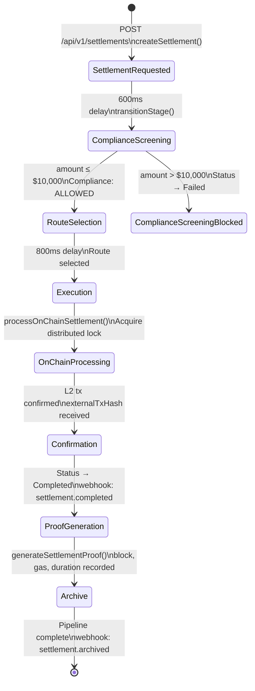
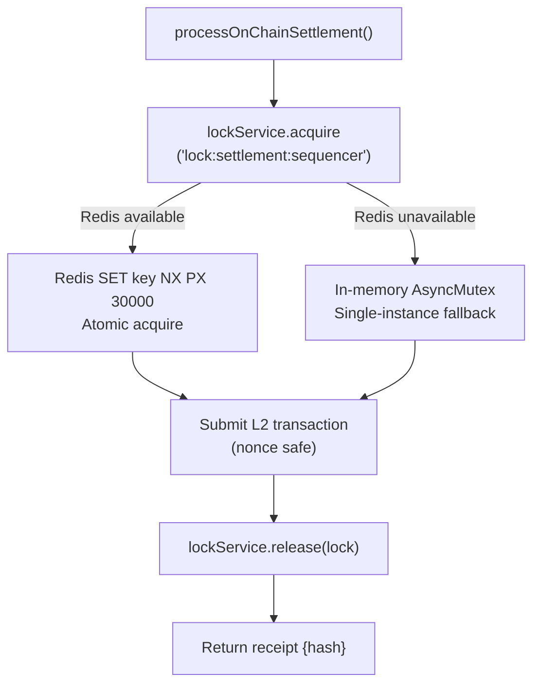
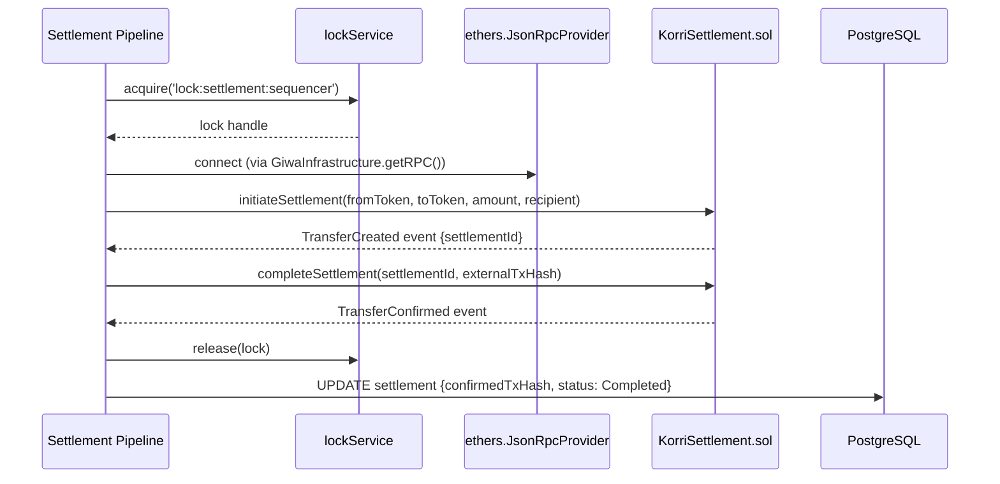

# Settlement Pipeline Architecture

> **Service:** `backend/src/services/settlementService.js`  
> **Pattern:** Asynchronous State Machine · Distributed Lock · ZK Proof Generation

---

## Overview

The settlement pipeline is a **7-stage asynchronous state machine** that processes each settlement from initial request through on-chain execution to cryptographic proof archival. The pipeline runs in the background after the API responds to the client, ensuring fast response times while guaranteeing eventual on-chain finality.

---

## Pipeline Stage Diagram



---

## Distributed Locking

The L2 on-chain execution step acquires a **distributed lock** before submitting the transaction to the GIWA sequencer. This guarantees that only one instance of the backend can increment the nonce at a time, preventing nonce collisions in multi-instance deployments.



### Lock Configuration
```javascript
lockName: 'lock:settlement:sequencer'
ttl: 30,000ms
retries: 30
retryDelay: 1,000ms
```

---

## Stage Transition Logging

Every stage transition is:
1. **Written to `pipelineHistory`** — a JSON array on the `Settlement` record serialised as a string
2. **Emitted as an event** on the `SettlementService` EventEmitter for real-time subscriptions
3. **Logged to stdout** with the settlement ID and timestamp

```javascript
// pipelineHistory example (JSON):
[
  { stage: "Settlement Requested",    timestamp: "2026-07-07T00:00:01Z" },
  { stage: "Compliance Screening",    timestamp: "2026-07-07T00:00:02Z" },
  { stage: "Route Selection",         timestamp: "2026-07-07T00:00:03Z" },
  { stage: "Execution",               timestamp: "2026-07-07T00:00:03.8Z" },
  { stage: "Confirmation",            timestamp: "2026-07-07T00:00:04.5Z" },
  { stage: "Proof Generation",        timestamp: "2026-07-07T00:00:05Z" },
  { stage: "Archive",                 timestamp: "2026-07-07T00:00:05.2Z" }
]
```

---

## On-Chain Settlement Flow



---

## ZK Proof Generation

After confirmation, the pipeline generates a `SettlementProof` record:

```javascript
// generateSettlementProof(settlement) creates:
{
  settlementId:       "settlement-1783375863424-abc123",
  txHash:             "0xabcd...ef01",
  blockNumber:        2450812,
  timestamp:          "2026-07-07T00:00:05.1Z",
  gasUsed:            "142,500",
  settlementDuration: 4200,   // ms from creation to confirmation
  proofStatus:        "Valid"
}
```

The `proofStatus` field is designed to evolve to integrate with the **kona-client** ZK proof system on the GIWA L2 network when production proof generation becomes available.

---

## RPC Simulation Fallback

If the GIWA RPC node is unreachable at pipeline startup, `SettlementService` falls back to **simulation mode**:

```javascript
// In simulation mode:
// - txHash is generated as a deterministic hex string
// - processOnChainSettlement() returns a mock receipt immediately
// - No real funds move on-chain
// - Pipeline continues through all stages for UI/testing consistency
```

Simulation mode is automatically engaged when:
- `isRpcReachable(rpcUrl)` returns `false` (800ms TCP connect timeout)
- `NODE_ENV === 'test'` or `PORT === '0'`

---

## Webhook Events

| Event | Trigger | Payload Fields |
|---|---|---|
| `settlement.created` | After DB record created | settlementId, initiator, amount, fromToken, toToken |
| `settlement.completed` | After `Confirmation` stage | settlementId, confirmedTxHash, timestamp |
| `settlement.failed` | On any pipeline exception | settlementId, error message |

---

## Idempotency

The pipeline tracks running pipelines with a `runningPipelines: Map<settlementId, Promise>`. Duplicate calls for the same `settlementId` return the existing promise rather than starting a new pipeline, preventing double-execution.
