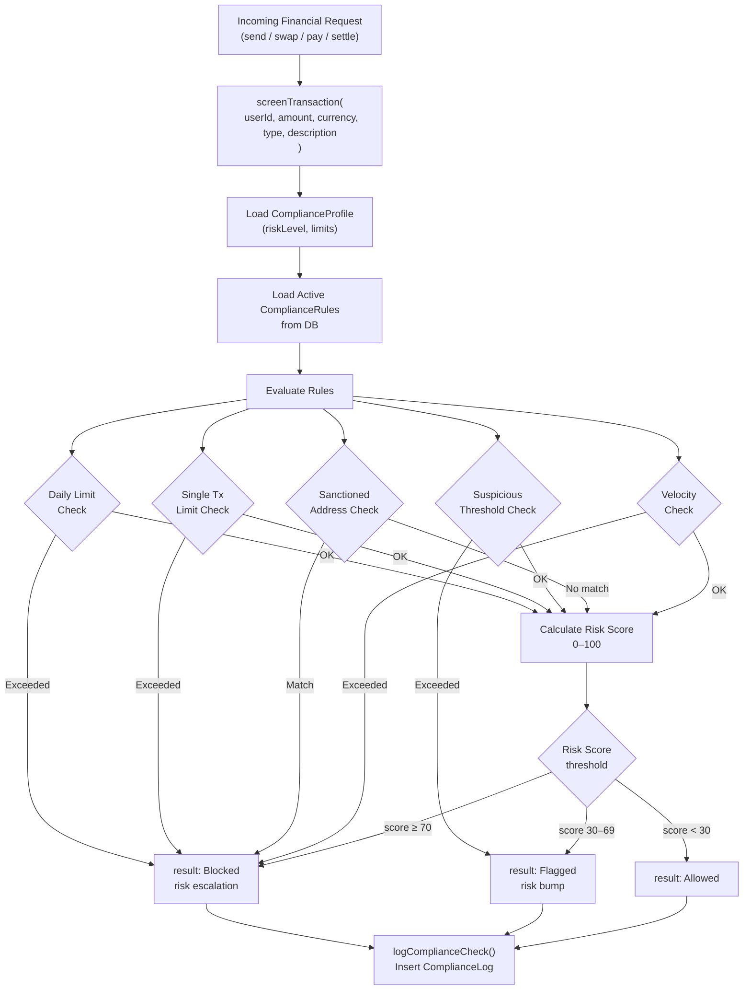

# Compliance Engine Architecture

> **Service:** `backend/complianceService.js`  
> **Models:** `ComplianceProfile`, `ComplianceRule`, `ComplianceLog`, `ComplianceReport`

---

## Overview

The Compliance Engine is a **real-time transaction screening system** that evaluates every financial operation against a configurable rule set before it is allowed to proceed. It runs inline with every `send`, `swap`, `pay`, and `settle` operation, blocking suspicious transactions before they reach the settlement pipeline.

---

## Screening Flow



---

## Rule Engine

Rules are stored in the `compliance_rules` table and loaded dynamically at screening time. Each rule has a `code`, `isActive` flag, and optional `value` threshold.

### Built-in Rule Codes

| Code | Name | Default Value | Blocks |
|---|---|---|---|
| `DAILY_LIMIT` | Daily Transaction Limit | $5,000 | Yes — over limit |
| `SINGLE_TX_LIMIT` | Single Transaction Limit | $2,000 | Yes — over limit |
| `SUSPICIOUS_THRESHOLD` | Suspicious Amount Threshold | $1,000 | No — flags only |
| `VELOCITY_CHECK` | Transaction Velocity | 10 tx/hour | Yes — rate exceeded |
| `SANCTION_LIST` | Sanctioned Address Screening | Address list | Yes — any match |
| `KYC_REQUIRED` | KYC Enforcement | — | Blocks if KYC not verified |

Rules can be toggled via `POST /api/compliance/rules/toggle` (admin only).

---

## Risk Scoring

The risk score is a composite 0–100 integer calculated as:

```
riskScore = baseScore
          + (violatedRules × 20)
          + (amount/suspiciousThreshold × 10)
          + kycPenalty (if KYC not completed: +15)
          + historyPenalty (if prior flags: +10)
```

| Score Range | Risk Level | Result |
|---|---|---|
| 0–29 | Low | Allowed |
| 30–69 | Medium | Flagged (allowed, logged) |
| 70–100 | High / Critical | Blocked |

---

## Compliance Profile

Every user has a `ComplianceProfile` with per-user overrides:

```javascript
{
  riskLevel: "Low" | "Medium" | "High" | "Critical",
  kycEnforced: true,
  dailyLimitUSD: 5000.00,
  singleTxLimitUSD: 2000.00,
  suspiciousThresholdUSD: 1000.00
}
```

Admins can update profiles via `POST /api/compliance/profile/update`.

---

## Compliance Log

Every screened transaction — whether allowed, flagged, or blocked — produces a `ComplianceLog` entry:

```javascript
{
  userId: "user-uuid",
  amount: 750.00,
  currency: "USD",
  riskScore: 22,
  riskLevel: "Low",
  result: "Allowed",
  rulesTriggered: "[]",
  details: "All checks passed. Amount within daily and single-transaction limits.",
  createdAt: "2026-07-07T00:00:01Z"
}
```

---

## Compliance Reports

Compliance reports aggregate screening activity over a configurable time period. Generated via:
- **Admin endpoint:** `POST /api/compliance/reports/generate`
- **Scheduled:** automatically via daily `setInterval` in server startup

```javascript
// Report schema:
{
  name: "Monthly Compliance Report — July 2026",
  type: "Monthly",
  startPeriod: Date,
  endPeriod: Date,
  totalTransactions: 1240,
  flaggedCount: 18,
  blockedCount: 3,
  summaryData: "{...}"   // JSON breakdown by currency, type, risk level
}
```

---

## Integration Points

| Operation | Where Called |
|---|---|
| `/api/v1/settlements` | `POST` handler, before `validateTransfer()` |
| `/api/transactions/send` | Before balance deduction |
| `/api/transactions/swap` | Before asset exchange |
| `/api/transactions/pay` | Before bill payment |
| `/api/merchant/pay` | Before merchant settlement |
| Admin audit | After any admin attestation action |
