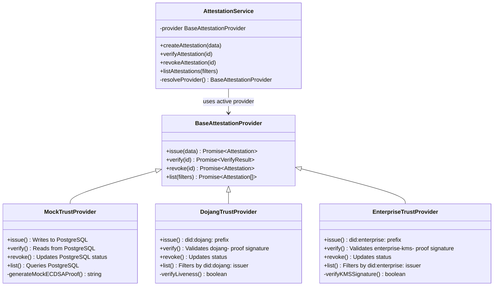
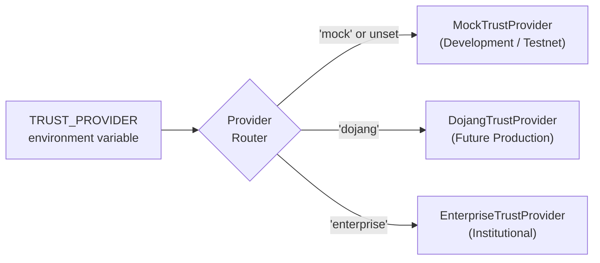
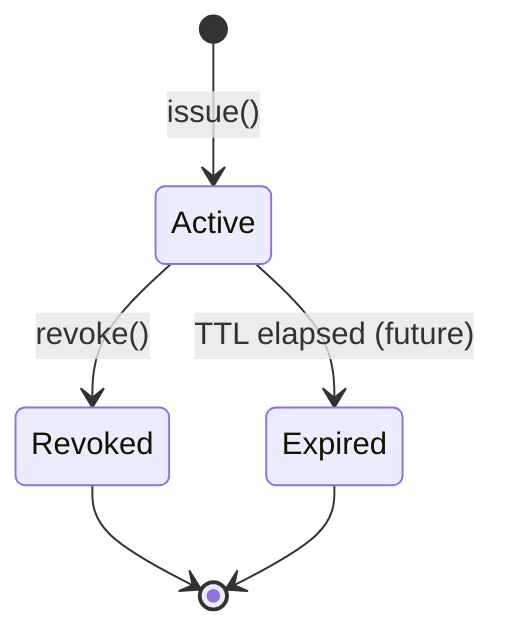
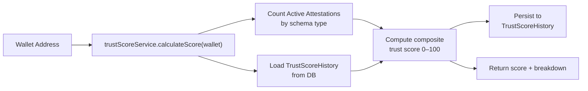

# Attestation Layer Architecture

> **Service:** `backend/src/services/attestationService.js`  
> **Pattern:** Strategy / Provider Pattern — switchable at runtime via `TRUST_PROVIDER` env var

---

## Overview

The Attestation Layer manages the full lifecycle of **identity, merchant, business, payroll, and compliance credentials** (attestations) for KorriPay users. It uses the **Strategy pattern** with a provider router, allowing seamless switching between `Mock`, `Dojang`, and `Enterprise` attestation backends.

---

## Provider Architecture



---

## Provider Selection



---

## Attestation Schema Types

| Schema | Purpose | Issued By |
|---|---|---|
| `Identity` | Personal KYC identity credential | KYC pipeline / Admin |
| `Merchant` | Merchant business registration | Admin / Dojang |
| `Business` | Corporate entity verification | Enterprise provider |
| `Payroll` | Employment / payroll credential | Enterprise provider |
| `Compliance` | Regulatory compliance clearance | Compliance engine |

---

## Attestation Lifecycle



### Status Values
| Status | `verificationState` | Meaning |
|---|---|---|
| `Active` | `Valid` | Credential is live and passes verification |
| `Revoked` | `Revoked` | Issuer has revoked the credential |
| `Expired` | `Expired` | Time-to-live exceeded (future implementation) |

---

## Proof Format by Provider

| Provider | Proof Format | Example |
|---|---|---|
| Mock | `mock-signature-ecdsa-sha256-0x{40 hex chars}` | `mock-signature-ecdsa-sha256-0xabcdef1234...` |
| Dojang | `dojang-proof-sig-0x{40 hex chars}` | `dojang-proof-sig-0x12345678ab...` |
| Enterprise | `enterprise-kms-sig-0x{40 hex chars}` | `enterprise-kms-sig-0xfedcba9876...` |

> **Note for RC3:** The Mock provider proof is a locally generated deterministic hex. In production with Dojang or EAS, this will be replaced with a real on-chain attestation UID from the EAS contract registry at `0xEA50000000000000000000000000000000000000`.

---

## DID (Decentralised Identifier) Prefixing

Each provider applies a DID prefix to the issuer field:

```javascript
// Mock:      issuer as-is
// Dojang:    "did:dojang:" + issuer   (if not already prefixed)
// Enterprise: "did:enterprise:" + issuer
```

This allows querying attestations by provider by filtering on the `issuer` field prefix.

---

## Attestation API Endpoints

| Method | Endpoint | Description |
|---|---|---|
| `POST` | `/api/v1/attestations` | Create new attestation (requires auth) |
| `GET` | `/api/v1/attestations` | List attestations, filter by schema/wallet/status |
| `GET` | `/api/v1/attestations/:id` | Get single attestation |
| `POST` | `/api/attestations` | Legacy create endpoint |
| `GET` | `/api/attestations/:id` | Legacy verify endpoint |
| `POST` | `/api/admin/attestations/issue` | Admin-issued attestation |
| `POST` | `/api/admin/attestations/:id/revoke` | Admin revocation |

---

## Trust Score Integration

The `trustScoreService` consumes attestation data to compute a **0–100 trust score** for any wallet address:



### Score Weights
| Factor | Weight |
|---|---|
| Identity attestation present | +30 |
| Compliance attestation present | +25 |
| Merchant attestation present | +20 |
| Business attestation present | +15 |
| Transaction history (positive) | +10 |
| Any Revoked attestations | −20 per |
