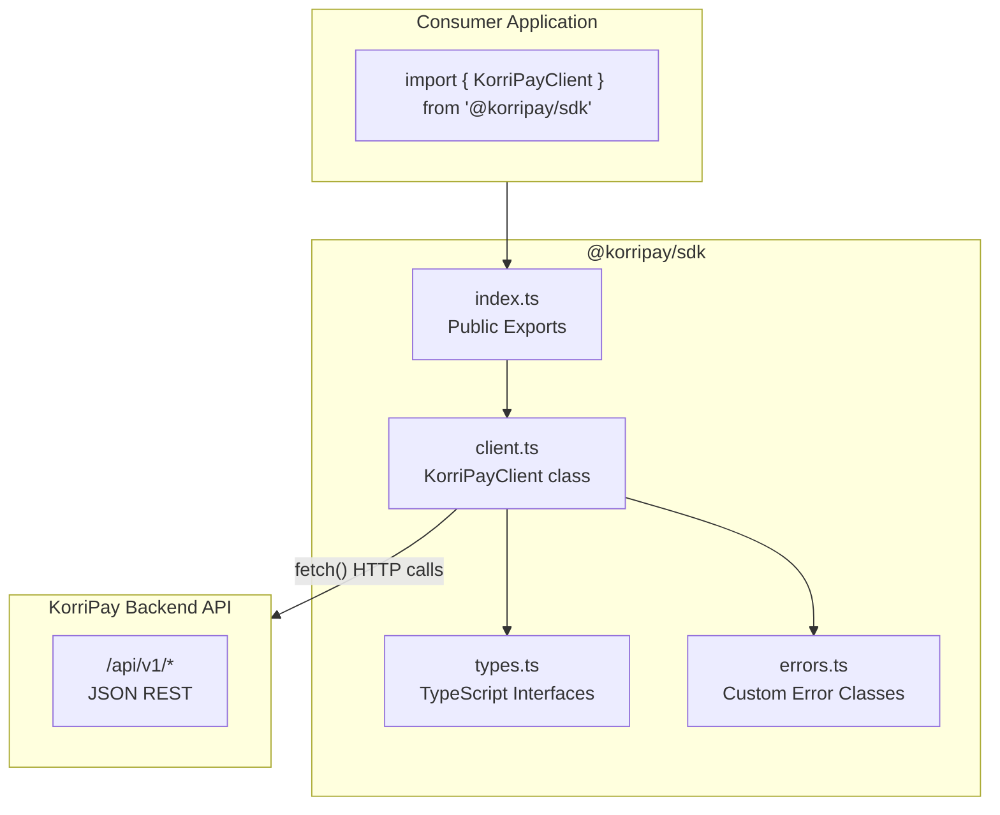
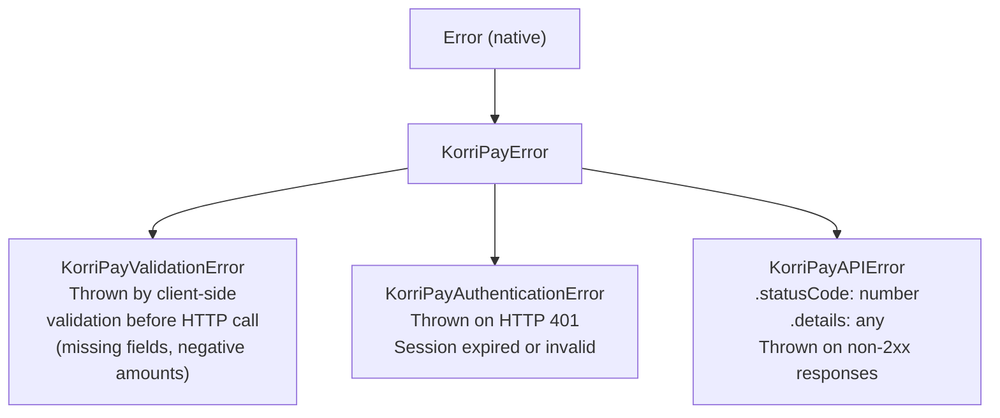
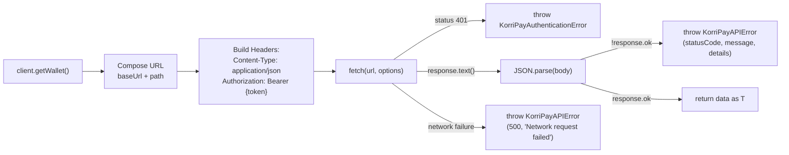

# SDK Architecture

> **Package:** `@korripay/sdk` · **Language:** TypeScript (ESM) · **Version:** 1.0.0  
> **Source:** `sdk/src/` · **Build Output:** `sdk/dist/`

---

## Overview

The KorriPay JavaScript/TypeScript SDK provides a type-safe, promise-based client for interacting with the KorriPay API v1. It abstracts HTTP transport, authentication headers, error classification, and request validation into a clean developer interface.

---

## Module Architecture



---

## `KorriPayClient` — Public Interface

```typescript
class KorriPayClient {
  constructor(config?: KorriPayConfig)

  // Settlements
  createSettlement(params: CreateSettlementParams): Promise<CreateSettlementResponse>
  getSettlement(id: string): Promise<Settlement>

  // Proofs
  getProof(settlementId: string): Promise<Proof | null>

  // Wallets
  getWallet(): Promise<Wallet>

  // Identity
  verifyIdentity(params: IdentityVerifyParams): Promise<IdentityVerifyResponse>
}
```

---

## Configuration

```typescript
interface KorriPayConfig {
  baseUrl?: string;   // Default: 'http://localhost:5000/api/v1'
  token?: string;     // Bearer JWT from POST /api/auth/signin
  headers?: Record<string, string>; // Additional headers
}
```

---

## Type Definitions (`types.ts`)

```typescript
interface Settlement {
  id: string;
  initiator: string;
  fromToken: string;
  toToken: string;
  amount: string;
  recipientDetails: string;
  status: "Pending" | "Completed" | "Failed";
  txHash?: string;
  confirmedTxHash?: string;
  pipelineStage: string;
  pipelineHistory: string; // JSON array string
  createdAt: string;
  confirmedAt?: string;
}

interface Proof {
  id: string;
  settlementId: string;
  txHash: string;
  blockNumber: number;
  timestamp: string;
  gasUsed: string;
  settlementDuration: number;
  proofStatus: "Valid" | "Pending" | "Invalid";
}

interface Wallet {
  id: string;
  balances: {
    USD:     { available: number; locked: number; pending: number };
    KRW:     { available: number; locked: number; pending: number };
    MockKRW: { available: number; locked: number; pending: number };
    NGN:     { available: number; locked: number; pending: number };
  };
  crypto: {
    BTC: number;
    ETH: number;
    USDC: number;
  };
}

interface CreateSettlementParams {
  recipient: string;
  amount: number;
  recipientAddress?: string;
  status?: "Pending" | "Success";
}
```

---

## Error Hierarchy



### Error Handling Pattern

```typescript
try {
  const result = await client.createSettlement({
    recipient: 'Alice',
    amount: 500
  });
} catch (error) {
  if (error instanceof KorriPayValidationError) {
    // Input failed client-side validation
    console.error('Bad input:', error.message);
  } else if (error instanceof KorriPayAuthenticationError) {
    // 401 — redirect to login
    window.location.href = '/';
  } else if (error instanceof KorriPayAPIError) {
    // Server returned an error
    console.error(`${error.statusCode}: ${error.message}`, error.details);
  }
}
```

---

## HTTP Transport

The `request<T>()` private method handles all HTTP communication:



---

## Build System

```
sdk/
├── src/           # TypeScript source
│   ├── client.ts
│   ├── types.ts
│   ├── errors.ts
│   └── index.ts   # Re-exports KorriPayClient + error classes + types
├── dist/          # Build output (gitignored)
│   ├── index.js   # Compiled ESM JavaScript
│   └── index.d.ts # Type declarations for consumers
├── tsconfig.json
└── package.json
```

Build command: `cd sdk && npm run build` (runs `tsc`)

---

## Installation & Usage

### Published (Future)
```bash
npm install @korripay/sdk
```

### Local Development
```bash
cd sdk && npm run build && npm link
cd your-app && npm link @korripay/sdk
```

### Obtaining a Token

```javascript
// Step 1: Authenticate via password
const res = await fetch('http://localhost:5000/api/auth/signin', {
  method: 'POST',
  headers: { 'Content-Type': 'application/json' },
  body: JSON.stringify({ email: 'user@example.com', password: 'secret' })
});
const { token } = await res.json();

// Step 2: Initialise the SDK client
const client = new KorriPayClient({
  baseUrl: 'http://localhost:5000/api/v1',
  token
});
```
