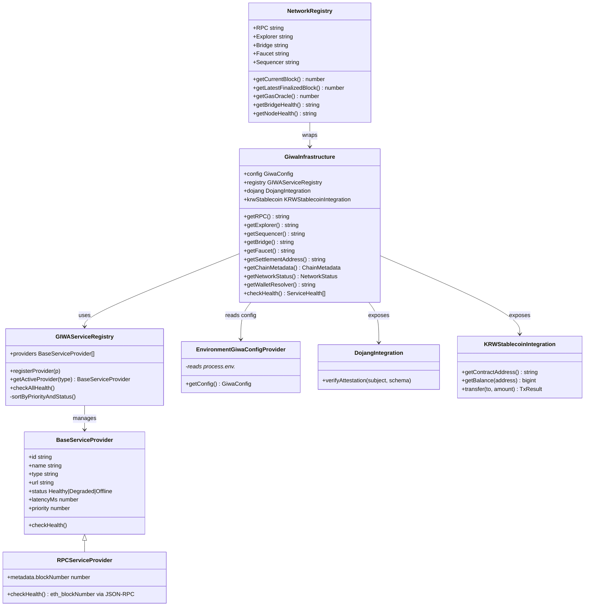
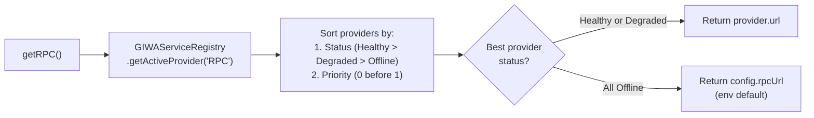

# GIWA Integration Layer Architecture

> **Module:** `backend/src/infrastructure/giwa/GiwaInfrastructure.js`  
> **Frontend Mirror:** `frontend/src/infrastructure/giwa/GiwaInfrastructure.js`  
> **Network:** GIWA L2 · Chain ID `92837` · Hardfork: Karst · EVM: Osaka

---

## Overview

The **GIWA Infrastructure Layer** is the central abstraction that isolates all GIWA L2 network concerns from the rest of the application. No service, controller, or frontend module is permitted to hardcode RPC URLs, chain IDs, or contract addresses. All blockchain configuration resolves dynamically through this singleton layer.

---

## Class Hierarchy



---

## Service Registry

The registry maintains a pool of all GIWA infrastructure service providers:

| ID | Name | Type | Priority |
|---|---|---|---|
| `rpc-primary` | Primary GIWA Node | `RPC` | 0 (primary) |
| `rpc-backup` | Backup GIWA Node | `RPC` | 1 (failover) |
| `explorer-primary` | Primary Explorer | `Explorer` | 0 |
| `explorer-backup` | Backup Explorer | `Explorer` | 1 |
| `faucet-primary` | GIWA Faucet | `Faucet` | 0 |
| `sequencer-primary` | GIWA Sequencer Address | `Sequencer` | 0 |
| `bridge-primary` | L1-L2 Token Bridge | `Bridge` | 0 |
| `attestation-primary` | EAS Schema Registry | `Attestation` | 0 |
| `resolver-primary` | up.id Name Resolution API | `NameResolver` | 0 |
| `stablecoin-primary` | GIWA MockUSD stablecoin | `Stablecoin` | 0 |

---

## Automatic Failover



The `RPCServiceProvider.checkHealth()` method sends `eth_blockNumber` JSON-RPC calls and marks providers as:
- **Healthy** — responded in < 800ms with valid block number
- **Degraded** — responded but > 800ms latency
- **Offline** — timed out or connection refused

---

## Network Configuration (via `EnvironmentGiwaConfigProvider`)

| Config Key | Environment Variable | Default |
|---|---|---|
| `chainId` | `GIWA_CHAIN_ID` | `92837` |
| `name` | `GIWA_NETWORK_NAME` | `GIWA Testnet (Sepolia)` |
| `rpcUrl` | `RPC_URL` | `http://127.0.0.1:8545` |
| `rpcBackupUrl` | `RPC_BACKUP_URL` | `https://rpc.giwa.io` |
| `explorerUrl` | `GIWA_EXPLORER_URL` | `https://explorer.giwa.io` |
| `sequencerAddress` | `GIWA_SEQUENCER_ADDRESS` | `0x17F53eE27...` |
| `bridgeAddress` | `GIWA_BRIDGE_ADDRESS` | `0x88F53eE27...` |
| `attestationAddress` | `GIWA_ATTESTATION_ADDRESS` | `0xEA50...0000` |
| `settlementAddress` | `SETTLEMENT_ADDRESS` | `0x9fE46736...` |
| `stablecoinAddress` | `GIWA_STABLECOIN_ADDRESS` | `0x9b3f5ce6...` |
| `hardfork` | — | `Karst` |
| `evmVersion` | — | `Osaka` |
| `nodeClient` | — | `op-reth` |
| `proofClient` | — | `kona-client` |

---

## GIWA L2 Network Properties

| Property | Value |
|---|---|
| Chain ID | `92837` |
| Hardfork | Karst |
| EVM Version | Osaka |
| Node Client | op-reth |
| Proof Client | kona-client |
| Max Tx Gas Limit | `16,777,216` |
| Target TPS | 14.2 |
| Sequencer Uptime | 99.98% |

### Osaka Precompiles

| Precompile | Status | Notes |
|---|---|---|
| `P256VERIFY` | Active | Increased gas cost vs mainnet |
| `MODEXP` | Active | Increased gas cost vs mainnet |
| `ecPairing` | Active | Capped at 300 pairs per call |

---

## `NetworkRegistry` — High-Level Accessor

`NetworkRegistry` wraps `GiwaInfrastructure` and adds computed properties:

```javascript
import { NetworkRegistry } from './src/infrastructure/giwa/index.js';
const registry = new NetworkRegistry(giwa);

registry.RPC              // → active RPC URL
registry.Explorer         // → active explorer URL
registry.Sequencer        // → sequencer address
await registry.getCurrentBlock()          // → latest block number
await registry.getLatestFinalizedBlock()  // → current - 64
await registry.getGasOracle()             // → gas price in gwei
await registry.getNodeHealth()            // → "Operational" | "Degraded"
await registry.getBridgeHealth()          // → bridge provider status
```

---

## Consumer Usage Pattern

```javascript
// All backend services import the singleton:
import { giwa } from '../infrastructure/giwa/index.js';

// Dynamic RPC resolution with automatic failover:
const provider = new ethers.JsonRpcProvider(giwa.getRPC());

// Chain metadata for API responses:
const meta = giwa.getChainMetadata();

// Service health check:
const health = await giwa.checkHealth();
```
