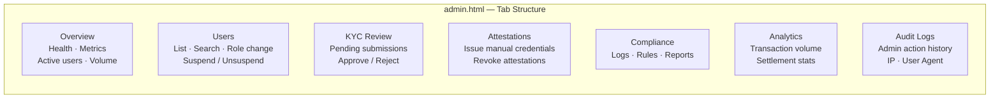
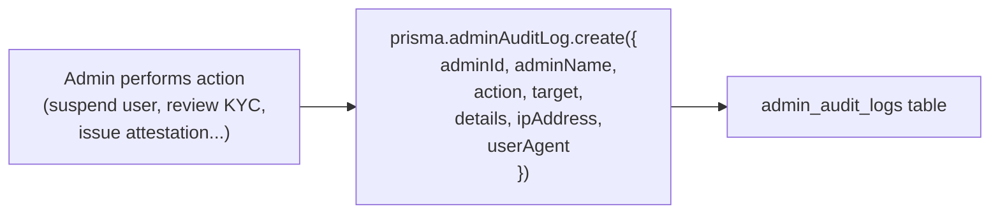
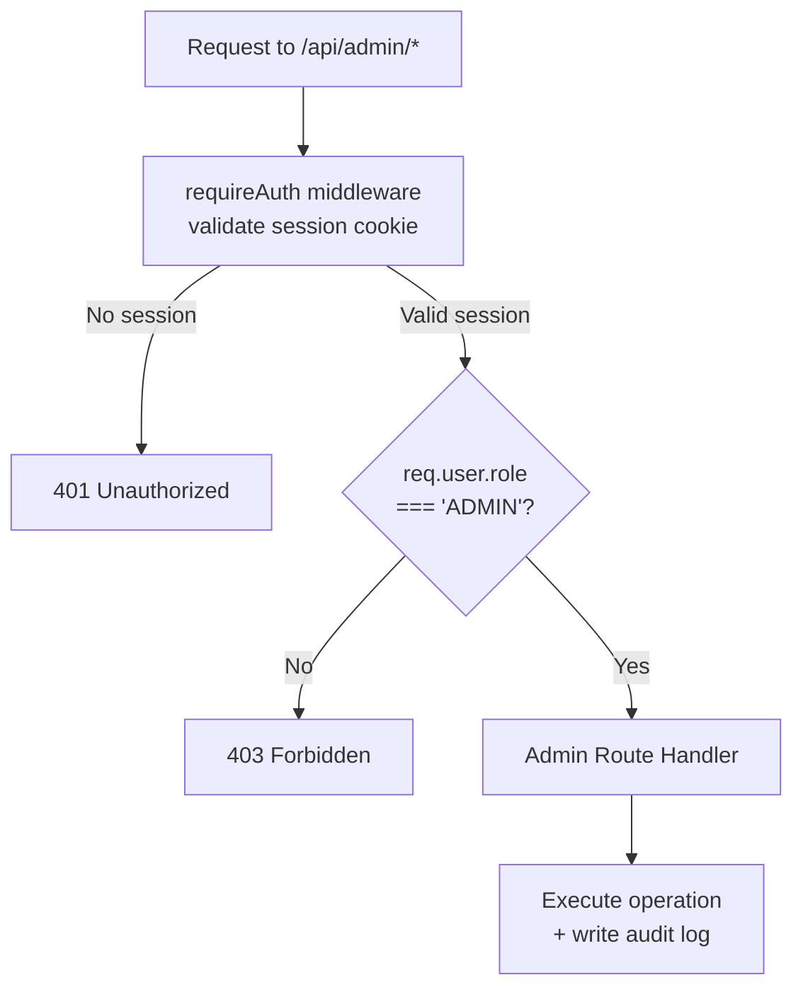

# Operations Dashboard Architecture

> **Files:** `frontend/admin.html` · `backend/adminController.js`  
> **Access:** `role === "ADMIN"` only · Protected by `requireAuth` + role check

---

## Overview

The Admin Operations Dashboard is a secure web interface for platform operators to manage users, review KYC submissions, manage attestations, monitor compliance, and view system health. It is served at `/admin` and requires an authenticated session with `ADMIN` role.

---

## Dashboard Sections



---

## Admin API Endpoints

All endpoints require `requireAuth` + `role === 'ADMIN'` check.

### User Management

| Method | Endpoint | Description |
|---|---|---|
| `GET` | `/api/admin/users` | List all users with wallet and KYC summary |
| `POST` | `/api/admin/users/:id/suspend` | Suspend or unsuspend a user account |
| `POST` | `/api/admin/users/:id/role` | Change user role (`USER` \| `ADMIN`) |

### KYC Management

| Method | Endpoint | Description |
|---|---|---|
| `GET` | `/api/admin/kyc` | List all KYC applications |
| `POST` | `/api/admin/kyc/:id/review` | Approve or reject a KYC submission |

### Attestation Management

| Method | Endpoint | Description |
|---|---|---|
| `GET` | `/api/admin/attestations` | List all attestations across all users |
| `POST` | `/api/admin/attestations/issue` | Manually issue an attestation credential |
| `POST` | `/api/admin/attestations/:id/revoke` | Revoke an existing attestation |

### System & Analytics

| Method | Endpoint | Description |
|---|---|---|
| `GET` | `/api/admin/wallets` | List all wallets with balances |
| `GET` | `/api/admin/transactions` | List all transactions platform-wide |
| `GET` | `/api/admin/settlements` | List all settlement records |
| `GET` | `/api/admin/compliance` | Compliance logs + active rules |
| `GET` | `/api/admin/analytics` | Transaction volume, settlement rate, flagged counts |
| `GET` | `/api/admin/health` | System health indicators (memory, uptime, DB) |
| `GET` | `/api/admin/audit-logs` | Admin action audit trail |

---

## Health Dashboard

The health endpoint (`/api/admin/health`) returns a comprehensive status object:

```javascript
{
  status: "Healthy",
  uptime: 86400,              // seconds since process start
  memory: {
    heapUsed: "48.2 MB",
    heapTotal: "72.0 MB",
    rss: "94.1 MB"
  },
  database: "Connected",
  settlements: {
    total: 1240,
    pending: 3,
    completed: 1218,
    failed: 19
  },
  users: { total: 847, suspended: 12 },
  giwaServices: [...]         // GiwaInfrastructure.checkHealth()
}
```

---

## Audit Logging

Every admin action writes to the `admin_audit_logs` table:



Audit logs are:
- **Immutable** — no update or delete endpoints exist
- **IP-tracked** — `req.ip` captured for forensic analysis
- **User-agent tracked** — browser/client identification preserved

---

## Access Control Flow


