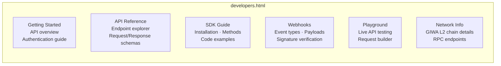
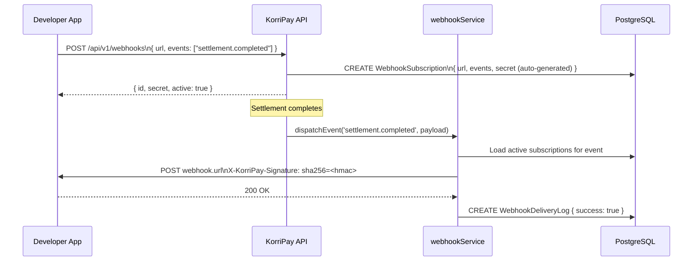
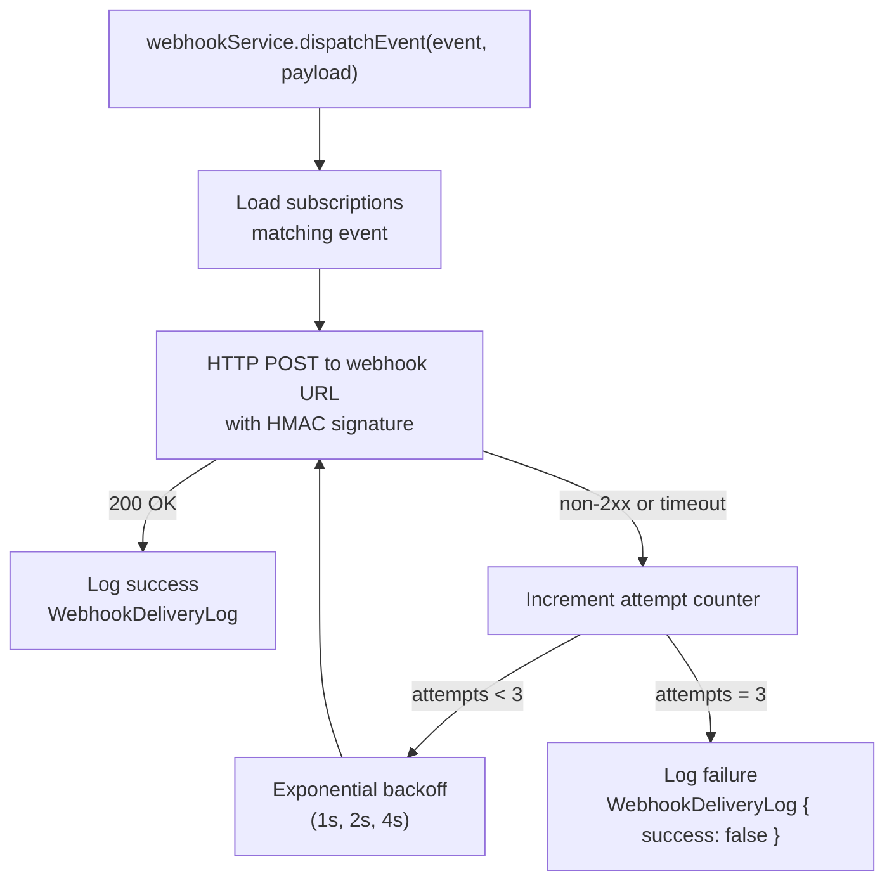

# Developer Portal Architecture

> **File:** `frontend/developers.html`  
> **Backend:** `/api-docs` (Swagger UI) · `/api/v1/*` endpoints

---

## Overview

The KorriPay Developer Portal is an in-product documentation and tooling interface for external developers who want to integrate with the KorriPay platform. It covers API reference, SDK usage, webhook configuration, and live testing tools.

---

## Portal Sections



---

## Swagger / OpenAPI Integration

The backend automatically generates an **OpenAPI 3.0** specification from JSDoc annotations in `apiV1.js`:

```javascript
// server.js
const swaggerOptions = {
  definition: {
    openapi: '3.0.0',
    info: {
      title: 'KorriPay Platform API',
      version: '1.0.0',
      description: 'Unified versioned REST APIs for settlements, wallets, proofs, and attestations.'
    },
    servers: [{ url: 'http://localhost:5000', description: 'Local Development Server' }],
    components: {
      securitySchemes: {
        cookieAuth: { type: 'apiKey', in: 'cookie', name: 'session' }
      }
    }
  },
  apis: ['./apiV1.js']
};
app.use('/api-docs', swaggerUi.serve, swaggerUi.setup(swaggerSpec));
```

**Interactive documentation available at:** `http://localhost:5000/api-docs`

---

## Webhook System Architecture



### Webhook Events

| Event | Trigger |
|---|---|
| `settlement.created` | New settlement request created |
| `settlement.completed` | Settlement confirmed on-chain |
| `settlement.failed` | Settlement pipeline failed |
| `attestation.issued` | New attestation created |
| `attestation.revoked` | Attestation revoked |
| `kyc.updated` | KYC status changed |

### Signature Verification (HMAC-SHA256)

```javascript
// Developer-side verification:
const crypto = require('crypto');

function verifySignature(payload, signature, secret) {
  const expected = 'sha256=' + crypto
    .createHmac('sha256', secret)
    .update(JSON.stringify(payload))
    .digest('hex');
  return crypto.timingSafeEqual(
    Buffer.from(signature),
    Buffer.from(expected)
  );
}
```

---

## Webhook Delivery Reliability



---

## Webhook Management Endpoints

| Method | Endpoint | Description |
|---|---|---|
| `POST` | `/api/v1/webhooks` | Register new webhook subscription |
| `GET` | `/api/v1/webhooks` | List your subscriptions |
| `DELETE` | `/api/v1/webhooks/:id` | Remove a subscription |
| `POST` | `/api/v1/webhooks/:id/rotate` | Rotate the HMAC signing secret |
| `POST` | `/api/v1/webhooks/:id/toggle` | Enable / disable subscription |

---

## Recipient Resolution (`.up.id`)

The developer platform exposes name resolution for `.up.id` wallet addresses:

```
GET /api/v1/recipients/resolve?name=alice.up.id
→ { address: "0xabcdef...", name: "alice.up.id", provider: "up.id" }
```

Resolution is handled by the `GiwaInfrastructure.getWalletResolver()` URL, pointing to the GIWA `.up.id` resolution service.

---

## GIWA Network Info Endpoint

```
GET /api/v1/network
```

Returns live GIWA L2 metadata for developer tooling:

```json
{
  "success": true,
  "network": {
    "name": "GIWA Testnet (Sepolia)",
    "chainId": 92837,
    "rpcUrl": "https://rpc.giwa.io",
    "explorerUrl": "https://explorer.giwa.io",
    "faucetUrl": "https://faucet.giwa.io",
    "sequencerAddress": "0x17F53eE27...",
    "bridgeAddress": "0x88F53eE27...",
    "settlementAddress": "0x9fE46736...",
    "hardfork": "Karst",
    "evmVersion": "Osaka",
    "nodeClient": "op-reth",
    "proofClient": "kona-client"
  }
}
```
