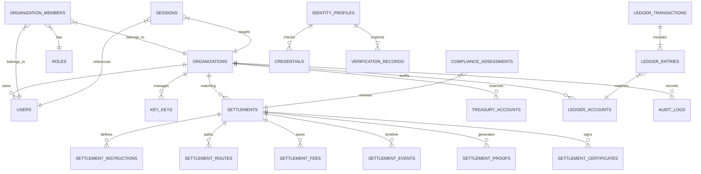

# Entity Relationship Diagram (ERD)

This document visualizes the relational domains of the KorriPay core database.

## Relational Domains

### 1. Identity Domain

Tracks participants, role assignments, authentication tokens, API keys, and multi-tenant organizational hierarchies.

### 2. Settlement Domain

Manages the lifecycle status changes of transactions, instructions, route selection, and settlement histories.

### 3. Treasury Domain

Double-entry ledger balances calculated dynamically from debit and credit items matching an immutable ledger transaction.
