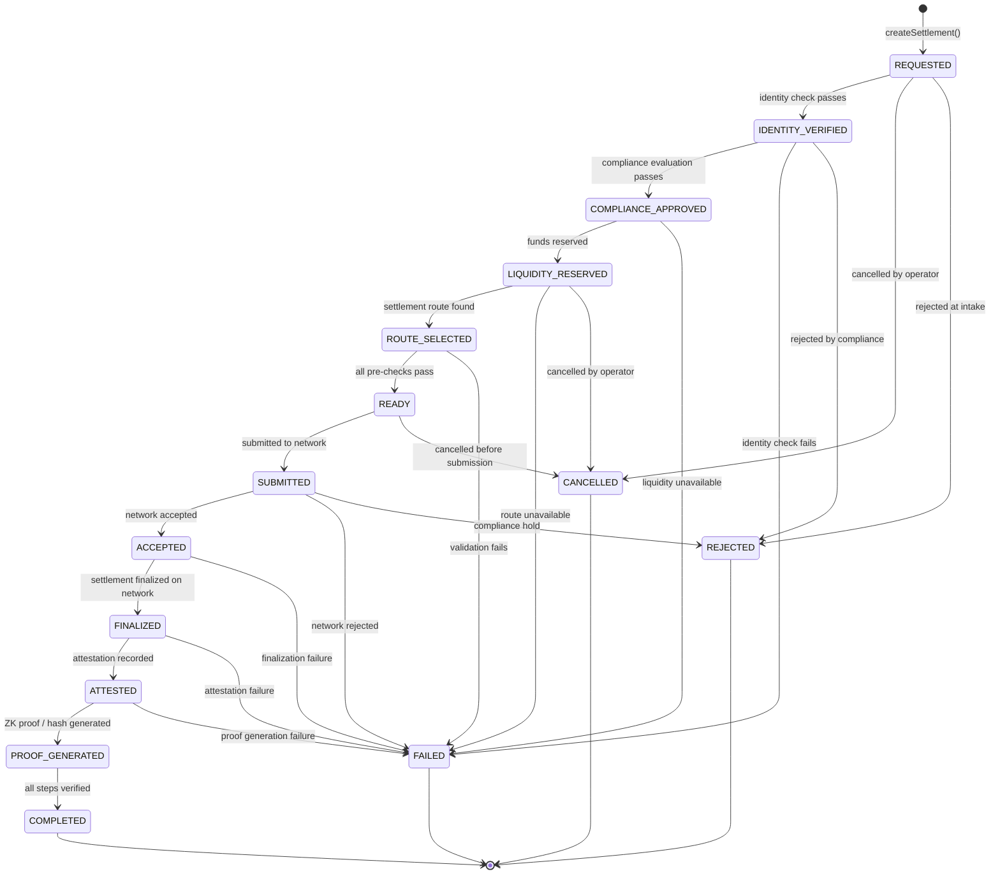

# Settlement Protocol State Machine

This document describes the formal state machine governing the KorriPay settlement lifecycle.

## State Diagram



## Valid Transitions Table

| From                  | To (valid)                                   |
| --------------------- | -------------------------------------------- |
| `REQUESTED`           | `IDENTITY_VERIFIED`, `CANCELLED`, `REJECTED` |
| `IDENTITY_VERIFIED`   | `COMPLIANCE_APPROVED`, `FAILED`, `REJECTED`  |
| `COMPLIANCE_APPROVED` | `LIQUIDITY_RESERVED`, `FAILED`               |
| `LIQUIDITY_RESERVED`  | `ROUTE_SELECTED`, `FAILED`, `CANCELLED`      |
| `ROUTE_SELECTED`      | `READY`, `FAILED`                            |
| `READY`               | `SUBMITTED`, `CANCELLED`                     |
| `SUBMITTED`           | `ACCEPTED`, `FAILED`, `REJECTED`             |
| `ACCEPTED`            | `FINALIZED`, `FAILED`                        |
| `FINALIZED`           | `ATTESTED`, `FAILED`                         |
| `ATTESTED`            | `PROOF_GENERATED`, `FAILED`                  |
| `PROOF_GENERATED`     | `COMPLETED`                                  |
| `COMPLETED`           | _(terminal)_                                 |
| `FAILED`              | _(terminal)_                                 |
| `CANCELLED`           | _(terminal)_                                 |
| `REJECTED`            | _(terminal)_                                 |

## Rules

1. **All transitions enforce the state machine.** Attempting an invalid transition throws `InvalidSettlementStateError`.
2. **Only `SettlementEngine` may change settlement state.** No other service calls `updateSettlementStatus` directly.
3. **Terminal states are irreversible.** `COMPLETED`, `FAILED`, `CANCELLED`, `REJECTED` have no outbound transitions.
4. **Every transition produces a `SettlementEvent` record** in the database — an immutable timeline.

## Implementation

```typescript
// packages/domain/src/state-machine/settlement-state-machine.ts
SettlementStateMachine.transition(current, next); // throws on invalid
SettlementStateMachine.canTransition(current, next); // returns boolean
SettlementStateMachine.isTerminal(status); // true for terminal states
SettlementStateMachine.allowedTransitions(from); // returns valid next states
```
