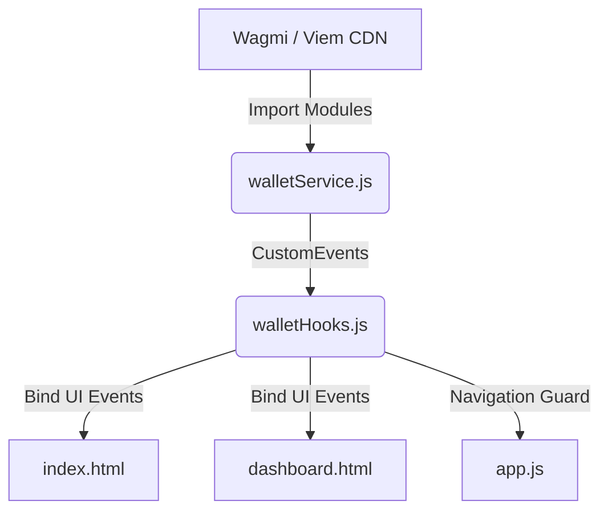

# KorriPay — Web3 Wallet Integration Instructions

This document provides a comprehensive overview of the Web3 wallet connectivity integrated into the KorriPay fintech dashboard.

---

## 1. Technology Stack
To avoid complex build steps (like Webpack or Vite configurations) and keep the frontend highly performant and lightweight, all dependencies are loaded dynamically as ES modules via the **esm.sh** CDN:
*   **Wagmi Core (`@wagmi/core@2.13.5`)**: The framework-agnostic core of Wagmi to manage configs, connections, account states, and network switching.
*   **Wagmi Connectors (`@wagmi/connectors@5.3.5`)**: Provides connectors for MetaMask/Injected wallets, Coinbase Wallet, and WalletConnect.
*   **Viem (`viem@2.21.49`)**: The underlying lightweight ether library for executing RPC calls, formatting addresses, and querying balances.
*   **Viem Chains (`viem@2.21.49/chains`)**: Contains predefined configurations for EVM networks (Ethereum, Polygon, Arbitrum, Optimism, Base, Sepolia).

---

## 2. Architecture & File Structure

The wallet integration uses a decoupled **Service-Hook-UI** design pattern to keep concerns separated:



### 1. `walletService.js` (The Wallet Service Layer)
*   **Location**: `frontend/walletService.js`
*   **Role**: Instantiates the Wagmi config, sets up connectors (MetaMask, Coinbase, WalletConnect), hooks up local storage for session persistence, and listens to low-level wallet events.
*   **Key Exports/APIs**:
    *   `init()`: Dynamically loads the CDN modules and registers account/chain listeners.
    *   `connect(type)`: Connects to a specific wallet (`"metamask"`, `"coinbase"`, or `"walletconnect"`).
    *   `disconnect()`: Disconnects the active wallet.
    *   `getAccount()`: Returns a snapshot of the current address, connection status, and active network.
    *   `getBalance()`: Queries the connected wallet's native balance.
    *   `switchNetwork(chainId)`: Switches the wallet to a supported network.

### 2. `walletHooks.js` (Vanilla JS Reactive Hooks)
*   **Location**: `frontend/walletHooks.js`
*   **Role**: Wraps custom events dispatched by the service layer into easy-to-use, framework-free reactive hooks. It also handles **DOM auto-binding** to target elements across both pages.
*   **Key Hooks**:
    *   `onConnect(callback)`: Fires when a wallet is successfully linked.
    *   `onDisconnect(callback)`: Fires on disconnect.
    *   `onStateChange(callback)`: Fires on any state transition (e.g. account or network changes).
    *   `requireWallet(redirectTo)`: Enforces dashboard protection by redirecting unauthorized visitors back to the landing page.

---

## 3. UI Integration & DOM Bindings

The integration binds to existing HTML elements without altering the premium UI layouts:

### `index.html` (Landing Page)
1.  **Wallet Selection**: Clicking any `.wallet-opt-btn` triggers `WalletService.connect(type)`. The modal switches to the loading/connecting spinner, then redirects to the dashboard once authorization is complete.
2.  **Hero Connect**: The CTA button (`#btn-hero-connect`) triggers the wallet options modal.
3.  **Scripts Load**: Loaded as modules at the bottom:
    ```html
    <script type="module" src="walletService.js"></script>
    <script type="module" src="walletHooks.js"></script>
    ```

### `dashboard.html` & `app.js` (Dashboard Page)
1.  **Enforced Guard**: `app.js` calls `window.WalletHooks.requireWallet()` on load. If no wallet session is active in local storage, the user is redirected to `index.html`.
2.  **Display Address**: Synchronizes and formats the connected address (`0x...`) in:
    *   `#profile-wallet-address` (Profile tab card)
    *   `#sidebar-wallet-address` (Left sidebar navigation footer)
3.  **Display Network**: Detects the chain ID and displays the network name inside `#profile-network-display`.
4.  **Disconnect**: Both the profile disconnect button (`#btn-disconnect-wallet`) and sidebar button (`#side-btn-disconnect`) trigger `WalletService.disconnect()` and redirect back to the home page.
5.  **Copy Address**: The `#btn-copy-wallet` button copies the real connected address to the clipboard and shows temporary visual checkmark feedback.

---

## 4. Setup & Local Development

### 1. WalletConnect Project ID Configuration
To use the WalletConnect connector, you must supply a Project ID:
1.  Get a free Project ID by signing up at [Reown / WalletConnect Cloud](https://cloud.walletconnect.com).
2.  Open `frontend/walletService.js`.
3.  Replace the placeholder at the top of the file:
    ```javascript
    const WALLETCONNECT_PROJECT_ID = "YOUR_WALLETCONNECT_PROJECT_ID";
    ```
    *Note: If left as default, the service will fall back to a public documentation/demo ID for development purposes.*

### 2. Running Locally
Run the development runner from the project root:
```bash
npm run dev
```
Open [http://localhost:5000](http://localhost:5000) in your browser.

---

## 5. Verification & Testing Checklist

- [ ] **Landing Page**: Open `index.html`, click **Connect Wallet**, select **MetaMask** or **WalletConnect**. Verify the modal displays the connecting state, prompts for browser signature/approval, and redirects to the dashboard on success.
- [ ] **Dashboard Redirect Guard**: Attempt to load `dashboard.html` directly in a private/incognito tab. Verify that the application redirects you back to `index.html` since no active session exists.
- [ ] **Wallet Address Display**: Connect a wallet and verify that the formatted address is displayed in the sidebar footer and the profile tab.
- [ ] **Network Display**: Connect on Sepolia or Polygon. Verify that the "Network Selection" text under the Profile tab correctly displays the active network name.
- [ ] **Copy Functionality**: Click the copy icon next to the address in the Profile tab. Verify that your actual wallet address is copied to the clipboard.
- [ ] **Session Persistence**: Refresh the dashboard page. Verify that the session remains active and you are not redirected or logged out.
- [ ] **Disconnect**: Click **Disconnect Wallet** in the profile or sidebar. Confirm the dialog, and verify that the session is cleared, the wallet disconnects, and you are redirected to the landing page.
